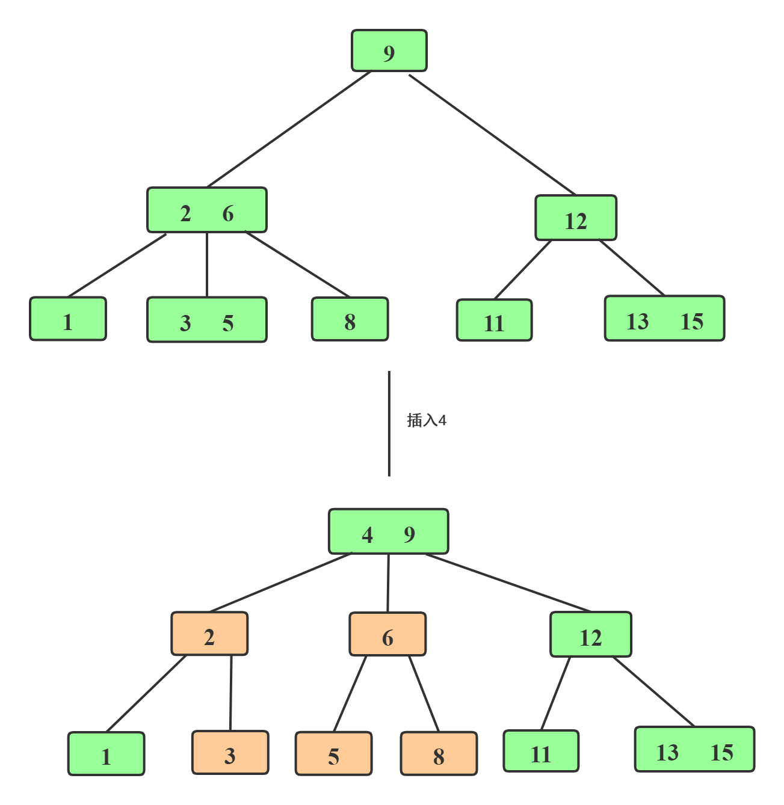
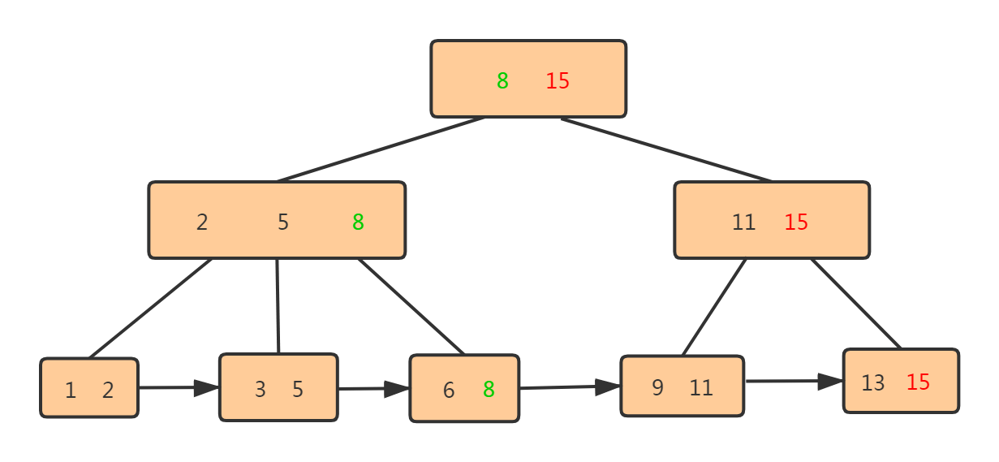

1. 定义

   - B 树

     M 阶的 B 树具有如下几个特征的平衡查找树:

     - 任意非叶子结点最多只有 M 个儿子, 且 M > 2
     - 根结点的儿子数为[2, M]
     - 除根结点以外的非叶子结点的儿子数为[M/2, M], 向上取整
     - 非叶子结点的关键字个数=儿子数-1
     - 所有叶子结点位于同一层
     - K 个关键字吧结点拆分为 K+1 段, 分别指向 K+1 个儿子, 同时满足查找树的大小关系

     B 树相对于 B+ 树的特点:

     - 关键字集合分布在整棵树中
     - 任何一个关键字出现且出现在一个结点中
     - 搜索可能在非叶子结点结束
     - 搜索性能等价于在关键字全集内做一次二分查找

     

     

   - B+ 树

     - B+ 树的特点

       - 有 n 棵子树的非叶子结点中含有 n 个关键字(B 树是 n-1 个),  这些关键字不保存数据, 只用来索引(因此每个磁盘页可以存放更多的索引结点, 这样进一步减少了磁盘 IO), 所有数据都保存在叶子结点(B 树是每个关键字都保存数据)
       - 所有的叶子结点包含了全部的关键信息, 及指向含这些关键字记录的指针, 且叶子结点本身依赖关键字的大小而顺序连接
       - 所有的非叶子结点可以看成是索引部分, 结点中仅含子树中最大或最小的关键字
       - 通常在 B+ 树上有两个头指针, 一个指向根节点, 一个指向关键字最小的叶子结点
       - 同一个关键字会在不同结点重复出现, 根结点的最大元素就是 B+ 树的最大元素

     - B+ 树相对 B 树的查询优势

       - B+ 树的中间结点不保存数据, 所以磁盘页能容纳更多结点元素
       - B+ 树查询必须找到叶子结点, B 树只要匹配到即可不用管元素位置, 因此 B+ 树查找更稳定
       - 对于范围查询来说, B+ 树只需要遍历叶子结点链表即可, B 树需要重复的中序遍历

       

2. 参考

   [1] : [b树和b+树的区别](<https://blog.csdn.net/login_sonata/article/details/75268075>)

   [2] : [Differences between B trees and B+ trees](https://stackoverflow.com/questions/870218/differences-between-b-trees-and-b-trees)

   [3] : [平衡二叉树、B树、B+树、B*树 理解其中一种你就都明白了](<https://zhuanlan.zhihu.com/p/27700617>)

   [4] : [为什么MySQL数据库索引选择使用B+树？](<https://blog.csdn.net/xlgen157387/article/details/79450295>)

   [5] : [MySQL索引为什么要用B+树实现？](<https://juejin.im/entry/5bc1ea0a5188255c2f424209>)