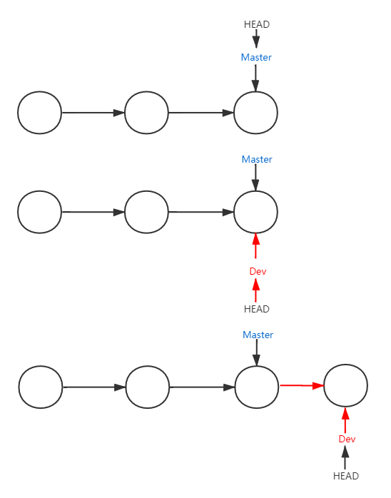

##### 基本使用

- ###### 初始化版本库	

    ```shell
    git init
    ```
    
- ###### 将修改从工作区添加到暂存区

    ```shell
    git add fileName
    ```

- ###### 将暂存区的修改提交
    ```shell
    git commit -m "commit message"
    ```

- ###### 提交记录查看
    ```shell
    git log
    ```

- ###### **回退版本**
    ```shell
    # 可以用 HEAD~100 指定版本
    git reset --hard HEAD^
    ```

- ###### 前进到之前的版本	
    ```shell
    git reflog
    git reset --hard 版本号ID
    ```

- ###### 撤销修改

    ```shell
    # 将工作区的修改撤销
    git checkout -- filename
    # 将暂存区的修改撤销
    git reset HEAD filename
    ```

- ###### 删除文件

    ```shell
    # 首先在文件系统执行命令删除文件
    rm filename
    # 将删除操作提交到暂存区
    git rm filename
    ```

- ###### 关联远程仓库

    ``` shell
    # 添加与远程仓库的管理
    git remote add origin https://github.com/sparkchan/remotetest.git
    # 删除远程仓库
    git remote rm origin
    # 推送到远程仓库
    git push -u origin master
    ```

- ###### 克隆远程仓库

    ```shell
    # 克隆远程仓库
    git clone https://github.com/sparkchan/remotetest.git
    ```

- ###### 拉取远程仓库

    ```shell
    # 拉取远程仓库并自动合并
    git pull
    # 拉取
    git fetch
    # 查看冲突
    git log -p master..origin/master
    ```

##### 概念理解

- ###### 工作区(Working Direcory)

    电脑中能够看到的目录

- ###### 版本库(Repository)

    - ###### 暂存区(Stage)

        `git add` 时将修改提交到暂存区

    - ###### 分支(Branch)

        默认分支为 master。`git commit` 就是将暂存区的所有修改提交到当前分支。

##### 分支管理

每次提交，Git 都会把它们串成一条时间线，这条时间线就是一个分支。



- ###### 创建分支并切换

    ```shell
    # 创建分支
    git branch <branchName>
    # 切换分支
    git checkout <branchName>
    # 查看分支，带星号的即为当前分支
    git branch 
    ```

- ###### 合并并删除分支

    ```shell
    # 合并分支
    git merge <branchName>
    # 删除分支
    git branch -d <branchName>
    # 强行删除一个未被合并过的分支
    git branch -D <branchName>
    # 查看分支合并图
    git log --graph
    # 合并时保留分支信息
    git merge --no-ff -m <description> <branchName>
    ```

- ###### Bug 分支

    ```shell
    # git 暂存区应该是所有分支共享的
    ####当前在 dev 分支上开发，但是开发没有完成不能提交###
    # 将当前分支的暂存区状态保存起来
    git stash
    ####在主分支上新建 Bug 分支 ####
    git branch <branchName>
    ####主分支合并 Bug 分支####
    git merge <branchName>
    ###将主分支 Bug 提交合并到 dev 分支###
    git cherry-pick <commitId>
    ###在 dev 分支恢复暂存区状态###
    # 查看保存的状态
    git stash list
    # 恢复状态
    git stash apply
    # 删除保存的状态
    git stash drop
    # 一次完成两步操作
    git stath pop
    ```

    ###### 标签管理

    ```shell
    # 创建标签
    git tag -a <tagName> -m <description> <commitId>
    # 查看标签
    git tag
    # 删除标签
    git tag -d <tagName>
    # 推送一个标签到远程
    git push origin <branchName> <tagName>
    # 推送所有标签
    git push origin <branchName> --tags
    # 删除远程标签
    git tag -d <tagName>
    git push origin <branchName> :refs/tags/<tagName>
    ```

##### 参考

[1] : [Git 教程](https://www.liaoxuefeng.com/wiki/896043488029600)

[2] : [Git 本地仓库操作](https://www.cnblogs.com/feeland/p/4500721.html)

[3] : [Git 分支 - 分支的新建与合并]([https://git-scm.com/book/zh/v2/Git-%E5%88%86%E6%94%AF-%E5%88%86%E6%94%AF%E7%9A%84%E6%96%B0%E5%BB%BA%E4%B8%8E%E5%90%88%E5%B9%B6](https://git-scm.com/book/zh/v2/Git-分支-分支的新建与合并))

[4] : [猴子都能懂的Git入门](https://backlog.com/git-tutorial/cn/stepup/stepup1_4.html)

[5] : [Git fetch和git pull的区别](https://blog.csdn.net/hudashi/article/details/7664457)

[6] : [Git教程](https://www.yiibai.com/git)