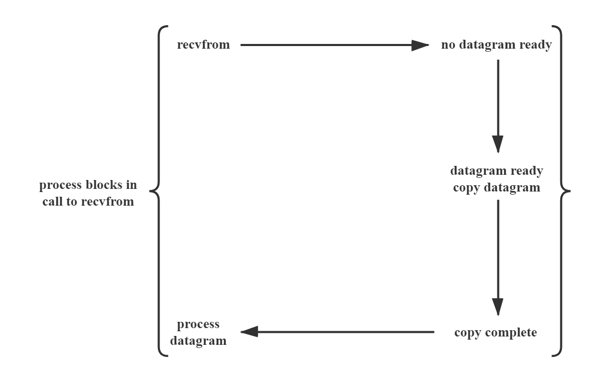
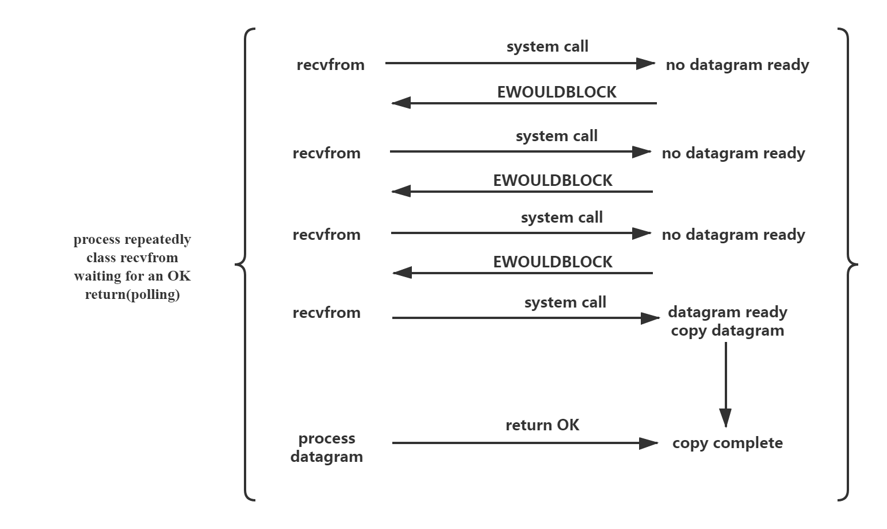
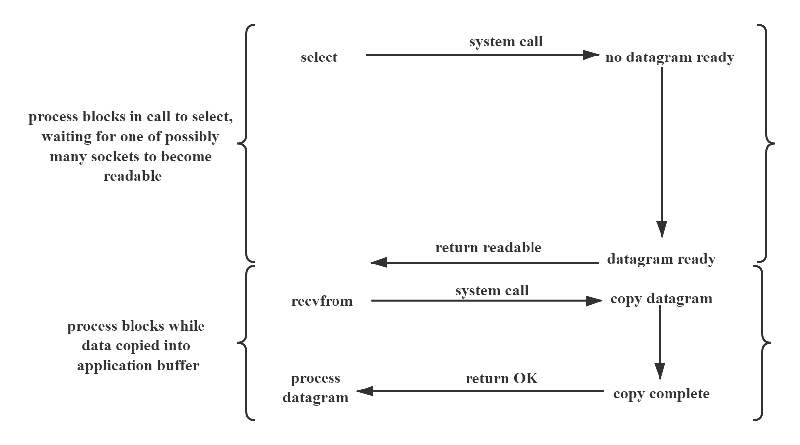
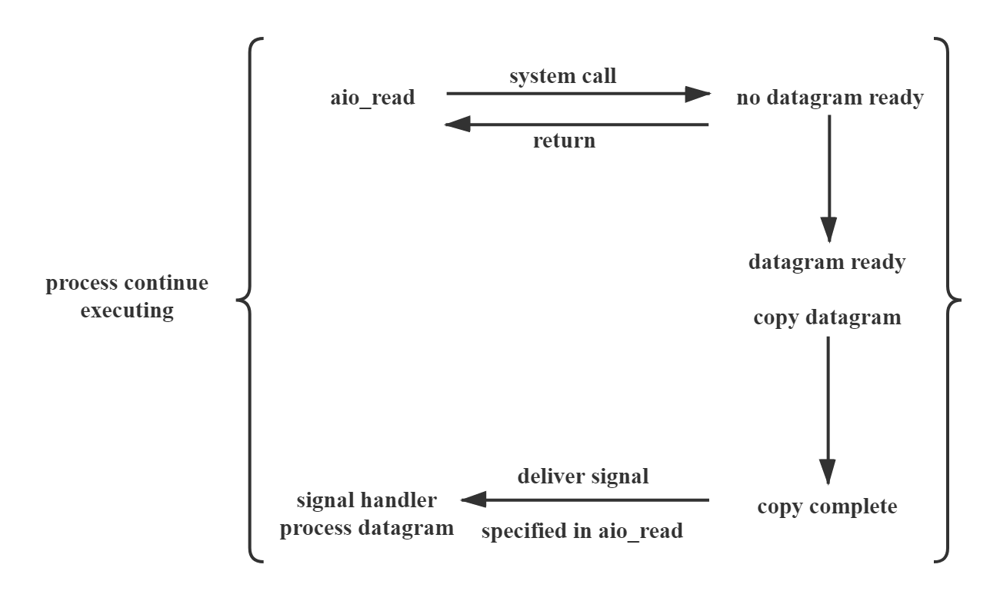
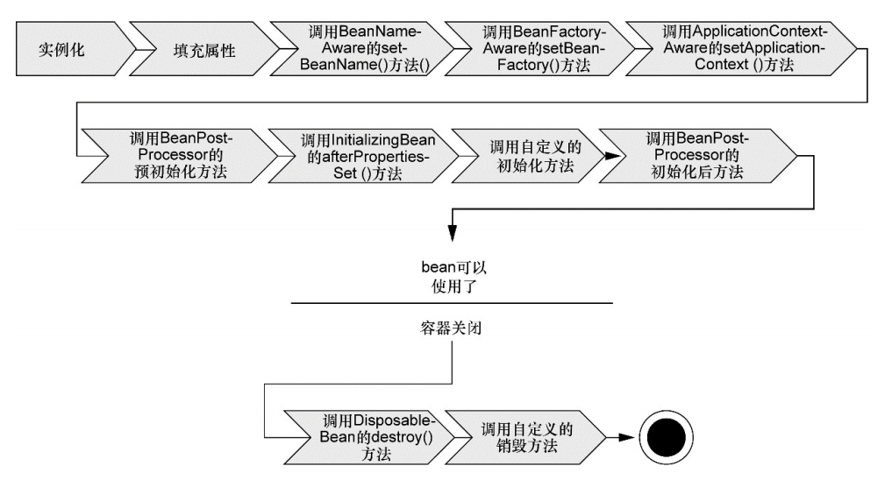
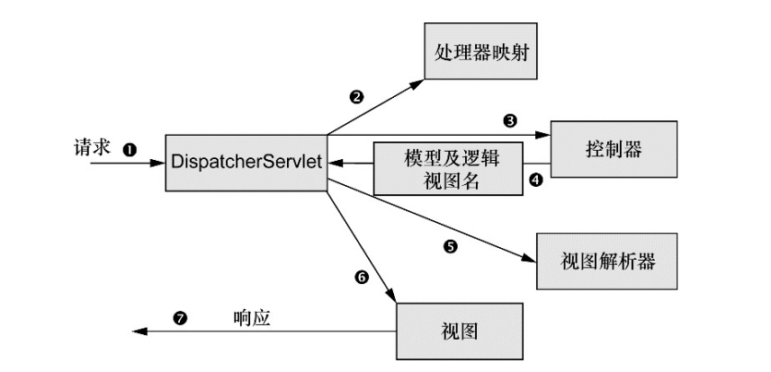
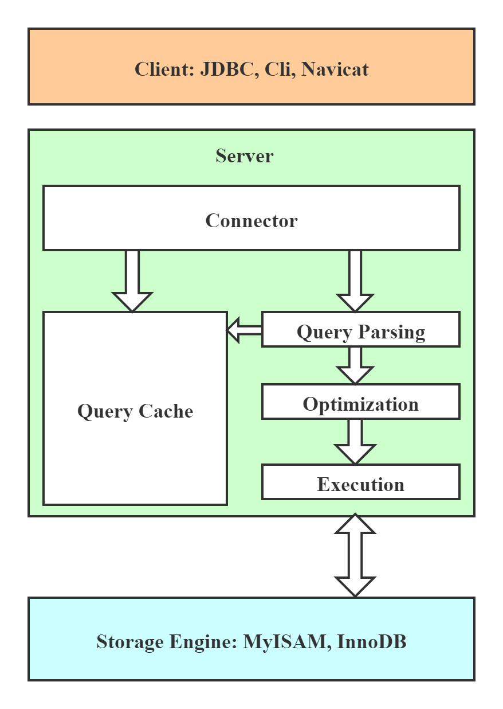

#### 面试题库资源:

[1] : [Java 最常见 200+ 面试题全解析：面试必备（附答案） - Java技术干货 - SegmentFault 思否](https://segmentfault.com/a/1190000019836576)

[2] : [JavaGuide](https://github.com/Snailclimb/JavaGuide)

[3] : [Java知识学习总结+源码阅读笔记](<https://github.com/javagrowing/interview-docs>)

[3] : [芋道源码](<http://svip.iocoder.cn/tags/%E9%9D%A2%E8%AF%95%E9%A2%98/>)

[4] : [正则表达式30分钟入门教程](<https://www.jb51.net/tools/zhengze.html#introduction>)

[5] : [2019年最新Java面试题及答案整理](<https://blog.csdn.net/qq_41701956/article/details/86686492>)

[6] : [史上最全阿里 Java 面试题总结](https://segmentfault.com/a/1190000016172470)

------

#### Java 基础

1. 面向对象特征: 封装, 继承, 多态(Java 多态 多态是同一个行为具有多个不同表现形式或形态的能力。 多态就是同一个接口，使用不同的实例而执行不同操作)

2. Java 基本类型:

   - boolean, char, byte, short, int, long, float, double

3. Integer 缓存问题:

   ```java
   Integer integer1 = 100;
   // 这里实际上调用的是 Integer#valueOf() 方法
   Integer integer2 = 100;
   Integer integer3 = new Integer(100);
   System.out.println(integer1 == integer2);
   System.out.println(integer1 == integer3);
   
   public static Integer valueOf(int i) {
       // 这里先从缓存中获取, -128 到 127
       if (i >= IntegerCache.low && i <= IntegerCache.high)
           return IntegerCache.cache[i + (-IntegerCache.low)];
       return new Integer(i);
   }
   ```

4. & 和 && 区别:

   前者不短路, 后者短路

5. Math.round(11.5) 等于多少？Math.round(-11.5)等于多少？
   Math.round(11.5)的返回值是12，Math.round(-11.5)的返回值是-11. 四舍五入的原理是**在参数上加 0.5 然后进行下取整**

6. switch是否能作用在byte上，是否能作用在long上，是否能作用在String上

   byte, short, char, int, Enum, String

7. 重写 equals() 方法的原则:

   equals方法必须满足自反性（x.equals(x)必须返回true）、对称性（x.equals(y)返回true时，y.equals(x)也必须返回true）、传递性（x.equals(y)和y.equals(z)都返回true时，x.equals(z)也必须返回true）和一致性（当x和y引用的对象信息没有被修改时，多次调用x.equals(y)应该得到同样的返回值），而且对于任何非null值的引用x，x.equals(null)必须返回false.

8. Object 类的方法:

   - toString():

     ```java
     public String toString() {
         return getClass().getName() + "@" + Integer.toHexString(hashCode());
     }
     ```

   - equals(): 默认采用 == 实现

   - getClass(): 获取对象的所属类的 Class 对象, 底层原生实现

   - hashCode(): 底层原生实现

   - clone(): 底层原生实现, 浅克隆, 深度克隆需要自己实现

   - notify():

   - notifyAll()

   - wait()

   - finalize()

9. 重载（Overload）和重写（Override）的区别。重载的方法能否根据返回类型进行区分

   - 方法的重载和重写都是实现多态的方式，区别在于**前者实现的是编译时的多态性**，而后者实现的是**运行时的多态性**。重载发生在一个类中(不一定发生在同一个类中, 子类也可以对父类方法进行重载)，同名的方法如果有不同的参数列表(参数顺序不同, 参数类型不同, 参数个数不同)则视为重载；**重写发生在子类与父类之间**，重写要求子类被重写方法与父类被重写方法有相同的返回类型，比父类被重写方法更好访问，不能比父类被重写方法声明更多的异常（里氏代换原则）。重载对返回类型没有特殊的要求(两同两小一大原则).

10. char 型变量中能不能存贮一个中文汉字

    char类型可以存储一个中文汉字，因为Java中使用的编码是Unicode（不选择任何特定的编码，直接使用字符在字符集中的编号，这是统一的唯一方法），一个char类型占2个字节（16比特），所以放一个中文是没问题的.

    

    使用Unicode意味着**字符在JVM内部和外部有不同的表现形式**，**在JVM内部都是Unicode**，当这个字符被从JVM内部转移到外部时（例如**存入文件系统中**），**需要进行编码转换**。所以Java中有字节流和字符流，以及在字符流和字节流之间进行转换的转换流，如InputStreamReader和OutputStreamReader，这两个类是字节流和字符流之间的适配器类，承担了编码转换的任务；对于C程序员来说，要完成这样的编码转换恐怕要依赖于union（联合体/共用体）共享内存的特征来实现了.

11. 内部类:

    - 静态内部类: 静态内部类可以访问外部类所有的静态变量，而不可访问外部类的非静态变量；静态内部类的创建方式，new 外部类.静态内部类()，如下：

      ```java
      Outer.StaticInner inner = new Outer.StaticInner();
      ```

    - 成员内部类: 员内部类可以访问外部类所有的变量和方法，包括静态和非静态，私有和公有。成员内部类依赖于外部类的实例，它的创建方式外部类实例.new 内部类()，如下：

      ```java
      Outer outer = new Outer();
      Outer.Inner inner = outer.new Inner();
      ```

    - 方法(局部)内部类:

    - 匿名内部类: 匿名内部类就是没有名字的内部类

      ```java
      public class Outer {
          private void test(final int i) {
              new Service() {
                  public void method() {
                      for (int j = 0; j < i; j++) {
                          System.out.println("匿名内部类" );
                      }
                  }
              }.method();
          }
      }
      //匿名内部类必须继承或实现一个已有的接口 
      interface Service{
          void method();
      }
      ```

    - 匿名内部类的 Class 名称为 外部类+$+数字 

    - 匿名内部类必须继承一个抽象类或者实现一个接口.

    - 匿名内部类不能定义任何静态成员和静态方法.

    - 当所在的方法的形参需要被匿名内部类使用时，必须声明为 final(要么声明为 final, 要么不更改它, 否则会报错).

    - 匿名内部类不能是抽象的，它必须要实现继承的类或者实现的接口的所有抽象方法.

    - 内部类 Class 文件命名格式: 外部类的名字+$+内部类的名字

    - 内部类内部会编译生成一个指向外部类的变量 `this$0`, 然后通过构造函数将外部类的对象传递进来

      ```Java
      class Outer$Inner {
          private String name;
      
          public Outer$Inner(Outer this$0, String name) {
              this.this$0 = this$0;
              this.name = name;
          }
      }
      ```

    - 局部内部类和匿名内部类访问局部变量的时候，为什么变量必须要加上final？

      - 其实，如果一个变量的值在编译期间可以确定，则编译器会默认在匿名内部类（局部内部类）的常量池中添加一个内容相等的字面量或直接将相应的字节码嵌入到执行字节码中.
      - 酱紫可以确保局部内部类使用的变量与外层的局部变量区分开，它们只是值相等而已.
      - 是因为**生命周期不一致**， 局部变量直接存储在栈中，当方法执行结束后，非final的局部变量就被销毁。而局部内部类对局部变量的引用依然存在，如果局部内部类要调用局部变量时，就会出错。加了final，可以确保局部内部类使用的变量与外层的局部变量区分开，解决了这个问题. 这样也就模拟了方法的值传递.
      - TODO 参数是如何有一个方法传递到另一个方法的.

    - 经典试题:

      ```java
      public class Outer {
          public static void print() {
              int a = 10;
              class Inner {
                  public void print() {
                      /**
                       *  如果这里没有用 final 修饰
                       *  则会生成一个 final int val$a 成员变量
                       *  该成员变量会在构造函数中进行初始化
                       *  通过 getfield(获取指定类的实例域, 并将其值压入栈顶)
                       */
                      System.out.println(a);
                  }
              }
              a = 20;
          }
      }
      
      
      public class Outer {
          public static void print() {
              final int a = 10;
              class Inner {
                  public void print() {
                      /** 
                       * 如果这里用 final 修饰
                       * bpush 10 这里字节码直接将 10 推送至栈顶
                       */
                      System.out.println(a);
                  }
              }
              a = 20;
          }
      }
      
      
      public class Outer {
          private int age = 12;
      
          class Inner {
              private int age = 13;
              public void print() {
                  int age = 14;
                  System.out.println("局部变量：" + age);
                  System.out.println("内部类变量：" + this.age);
                  System.out.println("外部类变量：" + Outer.this.age);
              }
          }
      
          public static void main(String[] args) {
              Outer.Inner in = new Outer().new Inner();
              in.print();
              // 输出 14, 13, 12
          }
      
      }
      ```

12. String, StringBuilder, StringBuffer 区别

    - String 类是 final 修饰的, 所以 String 是不能被继承的, 非静态的拼接逻辑在JDK 8中会自动被javac转换为StringBuilder操作.

      ```java
      // 该变量用 final 修饰, 这个才是String不可变的关键点；
      private final char value[];
      
      /** Cache the hash code for the string */
      private int hash; // Default to 0
      public int hashCode() {
          int h = hash;
          if (h == 0 && value.length > 0) {
              char val[] = value;
      
              for (int i = 0; i < value.length; i++) {
                  h = 31 * h + val[i];
              }
              // 这里对 hashCode() 进行了缓存
              hash = h;
          }
          return h;
      }
      ```

    - StringBuilder 

      StringBuilder 继承 AbstractStringBuilder, 默认初始化容量大小为 16

    - StringBuffer 

      StringBuilder 继承 AbstractStringBuilder, 它的每个方法都是采用 `synchronized` 修饰的.

13. 参考:

    [1] : [Java内部类解析你知道多少？](<https://zhuanlan.zhihu.com/p/103258844>)

    [2] : [How do hashCode() and identityHashCode() work at the back end?](https://stackoverflow.com/questions/4930781/how-do-hashcode-and-identityhashcode-work-at-the-back-end)

    [3] : [正则表达式30分钟入门教程](<https://www.jb51.net/tools/zhengze.html>)

------

#### NIO 网络编程:

1. Java IO 操作类型:

    - 基于字节: `Inputstream` 和 `OutputStream`
    - 基于字符: `Writer` 和 `Reader`
    - 字节流到字符流的转换: `InputStreamReader` , 它内部使用 `StreamDecoder` 采用 `UTF-8` 编码将输入的字节流转换为字符流.

2. Linux 五种 IO 模型:

    - 阻塞 IO(blocking I/O):

      应用调用 `recvfrom` 系统调用, 当前线程被阻塞, 当数据到达并由内核地址空间复制到用户地址空间后, 返回应用线程.

      

    - 非阻塞 IO (nonblocking I/O):

      应用循环去调用 `recvfrom` 系统调用, 该系统调用不阻塞当前应用线程, 若数据没有准备好, 则返回错误; 否则将数据由系统内核地址空间复制到用户地址空间, 然后返回.

      

    - IO 多路复用(I/O multiplexing):

      应用调用 `select` 系统调用, 系统阻塞, 当监听的一个或多个 `Socket` 有数据到来时, 返回到应用, 应用然后调用 `recvfrom` 系统调用, 数据从内核地址空间复制到用户地址空间, 然后返回.

      

    - 信号驱动 IO(signal driven I/O):

    - 异步 I/O(asynchronous I/O): 

      

3. 访问文件的方式:

    -  传统访问方式: 
        - 读: 用户线程调用读接口时, 操作系统在内核的高速缓存中能够找到数据, 将它复制到用户地址空间然后返回; 如果找不到, 则将将当前线程阻塞, 然后从磁盘中读取数据到内核的高速缓存中, 再将它复制到用户地址空间然后返回.
        - 写: 只是简单的将数据从用户地址空间复制到内核的高速缓存中, 对于用户程序来说, 写操作已经完成. 操作系统会将文件异步写入到磁盘中.
    - 内存映射:
        - 将用户的地址空间映射到内核的高速缓存中, 这样不用从内核的高速缓存复制数据到用户空间.
    - 直接 I/O 的方式:
        - 磁盘控制器直接将文件复制到用户地址空间而不用经过内核地址空间(数据库管理系统会采用这种方式).
    - 异步直接 I/O 方式:
        - 和同步方式相比就是不会阻塞当前的用户线程.

4. NIO Socket :

    ```java
    /**
     * 客户端代码
     */
    public class SocketClient {
        public void startClient() {
            InetSocketAddress hostAddress = new InetSocketAddress("127.0.0.1", 8090);
            SockectChannel client = SocketChannel.open(hostAddress);
            System.out.println("Client started");
            String threadName = Thread.currentThread.getName();
            List<String> messages = new ArrayList<>();
            for (int i = 0; i < 3; i++) {
                messages.add(threadName + "test" + i);
            }
            for (String message : messages) {
                byte[] messageBytes = message.getBytes();
                ByteBuffer buffer = ByteBuffer.wrap(messageBytes);
                client.write(buffer);
                System.out.println(message);
                buffer.clear();
                Thread.sleeep(5000);
            }
            client.close();
        }
    }
    
    /**
     * 服务端代码
     */
    public class SocketServer {
        private Selector selector;
        private InetSocketAddress listenAddress;
        
        public SocketServer(String address, int port) {
            listenAddress = new InetSocketAddress(address, port);
        }
        
        /**
         * 启动服务端
         */
        public void startServer() throws IOException {
            this.selector = Selector.open();
            // 相当于 ServerSocket
            ServerSocketChannel serverSocketChannel = ServerSocketChannel.open();
            serverSocketChannel.configureBlocking(false);
            serverSocketChannel.bind(listenAddress);
            // 这个一定要注册, 否则无法接收到连接请求
            serverSocketChannel.register(this.selector, SelectionKey.OP_ACCEPT);
            System.out.println("Server Started");
            while (true) {
                // 该方法会阻塞当前线程直到一个或多个事件发生
                this.selector.select();
                Iterator<SelectionKey> keys = this.selector.selectedKeys().iterator();
                while (keys.hasNext()) {
                    SelectionKey key = keys.next();
                    keys.remove();
                    if (!key.isValid()) {
                        continue;
                    }
                    if (key.isAcceptable()) {
                        this.accept(serverSocketChannel, key);
                    } else if (key.isReadable()) {
                        this.read(key);
                    }
                }
            }
        }
        
        /**
         * 接受连接
         */
        private void accept(ServerSocketChannel serverSocketChannel, SelectionKey key) throws IOException {
            SocketChannel channel = serverSocketChannel.accept();
            channel.configureBlocking(false);
            Socket socket = channel.socket();
            SocketAddress removeAddress = socket.getRemoteSocketAddress();
            channel.register(this.selector, SelectionKey.OP_READ);
        }
        
        /**
         * 读取数据
         */
        private void read(SelectionKey key) throws IOException {
            SocketChannel channel = (SocketChannel)key.channel();
            ByteBuffer buffer = ByteBuffer.allocate(1024);
            int numRead = -1;
            numRead = channel.read(buffer);
            if (numRead == -1) {
                Socket socket = channel.socket();
                SocketAddress remoteAddress = socket.getRemoteAddress();
                System.out.println("Connection closed by client: " + removeAddress);
                channel.close();
                return;
            }
            byte[] data = new byte[numRead];
            System.arraycopy(buffer.array(), 0, data, 0, numRead);
            System.out.println("Got: " + new String(data));
        }
    }
    
    public class Test {
        public static void main(String[] args) {
            Runnable server = () -> {
            	try {
                    new SocketServer("127.0.0.1". 8090);
                } catch(IOException e) {
                    e.printStackTrace();
                }
            };
            Runnable client = () -> {
               try {
                   new SocketClient().startClient();
               } catch (IOException e) {
                   e.printStackTrace();
               } catch (InterruptedException e) {
                   e.printStackTrace();
               }
            };
            // 启动服务器
            new Thread(server).start();
            // 启动客户端
            new Thread(client, "client-A").start();
            new Thread(client, "client-B").start();
        }
    }
    ```

5. 参考

    [1] : [Java Nio Socket Example](https://examples.javacodegeeks.com/core-java/nio/java-nio-socket-example/)

    [2] : [聊聊同步、异步、阻塞与非阻塞](https://www.jianshu.com/p/aed6067eeac9)

    [3] : [聊聊Linux 五种IO模型](https://www.jianshu.com/p/486b0965c296)

    [4] : [聊聊IO多路复用之select、poll、epoll详解](https://www.jianshu.com/p/dfd940e7fca2)

    [5] : [Getting started with new I/O (NIO)](https://developer.ibm.com/tutorials/j-nio/)

    [6] : [Different I/O Access Methods for Linux, What We Chose for Scylla, and Why](https://www.scylladb.com/2017/10/05/io-access-methods-scylla/)

    [7] : [Linux 网络 I/O 模型简介（图文）](<https://blog.csdn.net/anxpp/article/details/51503329>)

------

#### 多线程：

1. 进程和线程的区别:

    进程通俗来讲就是运行中的程序, 包括一系列的系统资源: 例如打开的文件, 等待的信号, 处理器的状态, 地址空间等, 一个进程包含一个或多个线程执行单元. 线程可以共享进程的资源, 又可以独立调度, 每一个线程都有自己的程序计数器, 方法栈.

    - Java 实现线程的三种方式:
        - 使用内核线程实现:

            程序一般会使用轻量级进程(Light Weigth Process), 每个轻量级进程都由一个内核线程支持. 

        - 使用用户线程实现:

        - 使用用户线程加轻量级进程混合实现: 轻量级进程作为用户线程和内核线程之间的桥梁.

    - 线程调度方式:

        - 协同式调度(Cooperative Threads-Scheduling)

            线程执行完才通知系统要切换到另外一个线程

        - 抢占式调度(Preemptive Threads-Scheduling)

            由系统来分配执行时间, 线程的切换不由线程本身决定

2. 守护线程(Daemon Thread): 

    是运行在后台的线程, 专门用于服务其它的线程. 当所有前台线程执行完毕后, 守护线程也将被终止. 在 Java 中垃圾回收线程就是特殊的守护线程.

3. 创建线程执行体的方式:

    - 继承 Thread 类并重写 run() 方法

    - 实现 Runnable 接口

    - 实现 Callable 接口

        `Callable` 的 `call()` 方法可以有返回值并且可以声明抛出异常. Java 提供 `FutureTask` 利用适配器模式将 `Callable` 的 `call()` 方法适配为 `Runnable` 的 `run()` 方法.  `FutureTask` 一次只能被一个线程执行, 它有一个 `state` 状态标志它是否被执行, 线程执行的结果可以通过 `FutureTask#get()` 方法获取.

4. runnable 和 callable 的区别:

    `Callable` 的 `call()` 方法可以有返回值并且可以声明抛出异常. Java 提供 `FutureTask` 利用适配器模式将 `Callable` 的 `call()` 方法适配为 `Runnable` 的 `run()` 方法.  `FutureTask` 一次只能被一个线程执行, 若没能获取到则直接返回, 不会执行 `call()` 方法.

5. 线程的状态:

    - NEW: 尚未启动

    - RUNNABLE: 正在执行中

    - BLOCKED: 等待锁的释放

        阻塞状态是从逻辑上来讲的, 就好比你进入一个房间, 但是现在房间被锁住了, 你没有房间的钥匙, 所以你被阻止在房间外了. 实际上底层仍然是将线程置于调度器不能调度的状态.

    - WAITING: 等待其它线程的通知

        当调用 `Object#wait()` 方法, `Thread#join()` 方法, `LockSupport#park()` 方法时, 都会进入到该状态.

        该状态仍然是一个逻辑上的状态, 就好比你让朋友打电话叫你起床, 你在睡觉的时候就好比调用了 `Object#wait()` 方法, 此时你就处于了 `WAITING` 状态, 实际上底层仍然是将线程处于调度器不能调度的状态. 当朋友打电话的时候就好比调用了`Object#notifyAll()`方法, 这时你就处于 `NEW` 状态了. 

    - TIMED_WAITING: 等待其它线程的通知, 指定时间等待

    - TERMINATED: 线程终止

    在 Linux 内核中并没有阻塞或等待状态, Linux 内核中与之相对应的是 `TASK_INTERRUPITLBLE` 状态. 处于该状态的线程在等待某个条件发生或者等待一个信号, 此时无法被调度器调度, 当条件发生或信号抵达时, 才会改变为 `TASK_RUNNING` 状态; 处于 `TASK_RUNNING` 状态的线程要么正在执行, 要么正在等待被调度.

6. sleep() 和 wait() 区别:

    `sleep()` 方法是 `Thread` 类的静态方法, 而 `wait()` 是对象的实例方法; 调用 `sleep()` 方法不会释放当前线程的锁, 而调用 `wait()` 方法会释放当前线程持有的锁; `sleep()` 方法到时间会自动恢复, `wait()` 方法可以通过 `notify()` 或 `notifyAll()` 方法恢复.

7. notify() 和 notifyAll() 区别:

    `nofityAll()` 会唤醒等待队列中所有的线程, 并将它们放入到同步队列中参与锁的竞争; `nofity()` 会唤醒等待队列中等待时间最长的线程.

8. volatile 的作用:

    volatitle 修饰的变量在值修改之后会将新的值立即同步回主内存中, volatitle 修饰的变量在读取值的时候会先从主存中刷新变量. 保证了多线程操作时变量的可见性.(Java 还有 synchronized 和 final 关键字实现可见性). volatile 还可以禁止指令重排, 对一个 volatile 变量的写操作先行发生于后面对这个变量的读操作.

9. Atomic 的原理:

    Atomic 主要利用底层硬件的原子性 CAS 指令和 volatitle 关键字保证原子操作; 底层的 CAS 指令保证了 Compare-Set 这一操作的原子性, volatitle 关键字保证了更改的数据对其它的可见性:  volatitle 修饰的变量在值修改之后会将新的值立即同步回主内存中, volatitle 修饰的变量在读取值的时候会先从主存中刷新变量.

10. synchronized 和 ReentrantLock 区别:

    ReentrantLock 使用起来比较灵活, 但是需要手动获取与释放锁, synchronized 不需要手动释放和开启锁; ReentrantLock 只适用于代码块锁, synchronized 可用于修饰方法, 代码块; volatile 标记的变量不会被编译器优化, synchronized 标记的变量可以被编译器优化.

11. synchronized 底层实现:

     synchronized 是由一对 monitorenter/monitorexit 指令实现的, monitor 对象是同步实现的基本单元. 在 JDK 1.6 之前, 是依赖操作系统底层的排它锁来实现的, 这时需要从用户态切换到内核态, 这种转换需要消耗处理器的时间, 如果代码块中的内容过于简单, 状态切换的时间可能比用户代码执行的时间还要长.

     JDK 1.6 之后引入了偏向锁, 轻量级锁. 

     - 偏向锁: 是指一段同步代码一直被一个线程所访问, 那么该线程会自动获取锁, 降低获取锁的代价(解决锁的重入问题). 此时在对象头的 Mark Word 中存放获取锁的线程的 ID.
     - 轻量级锁: 是指当锁是偏向锁时, 被另外的线程所访问, 偏向锁就会升级为轻量级锁, 其它线程会通过自旋的形式尝试获取锁, 不会阻塞, 从而提高性能(解决两个线程锁的竞争问题). 此时会在当前线程的栈帧中创建一个锁记录 (Lock Record) 的空间, 用于存储 Mark Word 的拷贝, 然后通过 CAS 操作尝试将对象的 Mark Word 更新为指向 Lock Record 的指针, 更新成功即表明该线程获取到锁.
     - 重量级锁: 当两个锁参与竞争轻量级锁时, 通过自旋等待的线程超过一定的次数, 或者有第三个线程来竞争锁时, 轻量级锁会升级为重量级锁(这里的重量级指的是会通过系统调用来将线程挂起). 此时对象头的 Mark Word 指向重量级锁 (互斥量) 的指针.

     

12. 线程池的状态:

      - RUNNING: 接受新的任务, 处理等待队列中的任务.
      - SHUTDONW: 不接受新的任务提交, 但是会继续处理等待队列中的任务.
      - STOP: 不接受新的任务提交, 不再处理等待队列中的任务, 中断正在执行任务的线程.
      - TYDING: 所有任务都销毁了, workCount 为 0, 线程池的状态在转换为 TIDYING 状态时, 会执行钩子方法 `terminated()`.
      - TERMINATED:  `terminated()` 方法结束后, 线程池的状态就会变成这个.

13. 线程池:

      * 原理: 

          传统的多线程是针对每一个任务都去创建一个线程, 创建线程会消耗系统的资源, 如果任务很多但是每个任务又都很小, 那么就会导致大量的系统资源被消耗和浪费. 而使用线程池则可以降低资源的消耗, 线程池将任务和线程的执行分隔开来, 使得一个线程可以获取多个任务来执行, 这样减少了创建线程的数量, 使用线程池可以带来如下的好处:

          * 降低资源的消耗: 通过重复利用已创建的线程降低线程创建和销毁造成的消耗.
          * 提高相应速度: 当任务到达时, 任务可以不需要等到线程创建就能立即执行.
          * 提高线程的可管理性: 可以同意分配, 调优和监控线程.

          当提交一个新任务到线程池时:

          * 线程池判断**核心线程池里的线程**是否都在执行任务. 如果不是, 则创建一个新的工作线程来执行任务. 如果是, 则进入下一个流程.
          * 线程池判断工作队列是否已经满. 如果工作队列没有满, 则将新提交的任务存储在这个工作队列中. 如果满了, 则进入下一个流程.
          * 线程池判断**线程池的线程**是否都处于工作状态. 如果没有, 则创建一个新的工作线程来执行任务. 如果满了, 则交给饱和策略来处理这个任务.

      * 线程池的创建:

          - FixedThreadPool: 可重用固定线程数的线程池

              ```java
              public static ExecutorService newFixedThreadPool(int nThreads) {
                  /*
                   * corePoolSize 和 maximumPoolSize 都被设置为固定值
                   * 当线程池的线程数大于 corePoolSize 时, keepAliveTime 为多于的空闲线程等待新任务
                   * 的最长时间, 超过这个时间后多余的线程将被终止. 这里把 keepAliveTime 设置为 0L, 意		 * 味着多于的空闲线程会被立即终止
                   */
                  return new ThreadPoolExecutor(nThreads, nThreads,
                                                0L, TimeUnit.MILLISECONDS,
                                                new LinkedBlockingQueue<Runnable>());
              }
              ```

              `FixedThreadPool` 使用无界队列 `LinkedBlockingQueue` 作为线程池的工作队列(队列的容量为 Integer.MAX_VALUE). 使用无界队列的影响:

              - 当线程池中的线程数量达到 `corePoolSize` 后, 新任务将在无界队列中等待, 因此线程池的线程数不会超过 `corePoolSize` .
              - 由于上面原因, 使用无界队列时, `maximumPoolSize` 将是一个无效参数.
              - 由于上面两个原因, 使用无界队列时, `keepAliveTime` 将是一个无效参数.
              - 由于使用无界队列, 运行中的 `FixedThreadPool` 不会拒绝任务.

          - SingleThreadExecutor: 单个线程数的线程池

              ``` Java
              public static ExecutorService newSingleThreadExecutor() {
                  /*
                   * corePoolSize 和 maximumPoolSize 都被设置为 1, 其余和 FixedThreadPool 相同
                   */
                  return new FinalizableDelegatedExecutorService
                      (new ThreadPoolExecutor(1, 1,
                                              0L, TimeUnit.MILLISECONDS,
                                              new LinkedBlockingQueue<Runnable>()));
              }
              ```

          - CachedThreadPool: 根据需要创建新线程的线程池    

              ```java
               public static ExecutorService newCachedThreadPool() {
                   /*
                    * 这里的 corePoolSize 被设置为 0, maximumPoolSize 
                    * 被设置为 Integer.MAX_VALUE, keepAliveTime 设置为
                    * 60L
                    */
                   return new ThreadPoolExecutor(0, Integer.MAX_VALUE,
                                                 60L, TimeUnit.SECONDS,
                                                 new SynchronousQueue<Runnable>());
               }
              ```

              `CachedThreadPool` 使用没有容量的 `SynchronousQueue` 作为线程池的工作队列. 由于 `CachedThreadPool` 的 `maximumPoolSize` 是无界的, 如果主线程提交任务的速度高于 `maximumPool` 中线程处理任务的速度, `CachedThreadPool` 会不断创建新的线程.

          - newSingleThreadScheduledPool(): 创建单个线程的可进行定时或周期性工作调度的线程池

          - newThreadScheduledPool(): 创建多个线程的可进行定时或周期性工作调度的线程池

          - newWorkStealingPool(): 创建持有足够的线程的线程池来支持给定的并行级别. 默认会创建和处理器核心数量相同的线程.

      * 线程池关闭:

          关闭线程池可以调用线程池的 `shutdown()` 或 `shutdownNow()` 方法来关闭线程池. 它们的原理是遍历线程池中的工作线程, 然后逐个调用线程的 `interrupt()` 方法来中断线程, 所以无法响应中断的线程永远无法终止.

          `shutdownNow()` 先将线程池的状态设置 `STOP`, 然后尝试**停止所有的正在执行或暂停任务**的线程, 并**返回等待执行任务的列表**;  `shutdown()` 只是将线程池的状态设置为 `SHUTDOWN` 状态, 然后**中断所有没有正在执行任务**(正在执行的线程不中断, 等待它们执行完毕)的线程.

          只要调用了上面两个方法中任意一个, `isShutdown()` 方法就会返回 true. 当所有的任务都已经关闭后, 才表示线程池关闭成功, 这时调用 `isTerminated()` 方法返回 true.

14. 线程池 submit() 和 execute() 方法区别:

`execute()` 执行 `Runnable` 类型任务, 无返回值; `submit()` 执行 `Callable` 类型任务, 有返回值, 在内部是通过将 `Callable` 包装成 `FutureTask` 执行.

15. 死锁:

    - 死锁举例:

        当线程 A 持有独占锁 a, 并尝试去获取独占锁 b 的同时, 线程 B 持有独占锁 b, 并尝试去获取独占锁 a 的情况下, 就会发生 AB 两个线程由于互相持有对方需要的锁, 而发生的阻塞现象.

    - 产生死锁的条件:
        - 互斥条件(mutual exclusion): 一个资源每次只能被一个线程使用, 此时如果有其它线程请求该资源, 则请求线程只能等待.
        - 请求与保持条件(hold and wait or resource holding): 线程中已经保持了至少一个资源, 但是又提出了新的资源请求, 而该资源已经被其它线程占有, 此时请求线程被阻塞, 但是自己对已经获得资源保持不放.
        - 不剥夺条件(no preemption): 线程未使用完的资源在未使用完毕之前, 不能被其它线程强行夺走, 即只能由获得该资源的线程自己来释放.
        - 循环等待条件(circle wait): 线程间形成守卫相接循环等待资源的关系. 在发生死锁时必然存在一个线程等待队列 {P1, P2, P3, ..., Pn}, 其中 P1 等待 P2 占有的资源, P2 等待 P3 占有的资源, ..., Pn 等待 P1 占有的资源, 形成一个线程等待环路.

    - 死锁避免:
        - 破环请求保持条件:
            - 静态分配: 每个进程在开始执行时就申请它所需要的全部资源.
            - 动态分配: 每个进程在申请所需要的资源时它本身不占用系统资源.
        - 破环不可剥夺条件:
            - 等待期间将占用的资源隐式的释放掉, 供其它线程使用, 等待的线程只有重新获取自己原有的资源以及新申请的资源才可以重新启动, 执行(例如调用 wait() 方法).
        - 破环循环等待条件:
            - 采用资源有序分配的基本思想. 将系统资源顺序进行编号, 将紧缺的, 稀少的资源采用较大的编号, 申请资源时必须按照编号的顺序执行, 有小编号资源的线程才能申请较大编号的资源.
        - 常见方法:
            - 避免一个线程同时获取多个锁
            - 避免一个线程在锁内同时占用多个资源, 尽量保证每个锁只占用一个资源
            - 尝试使用定时锁
            - 对数据库加锁和解锁必须在一个数据库连接里, 否则会出现解锁失败
        - 具体操作:
            - 尽量使用 `tryLock(long timeout, TimeUnit unit)` 的方法 (ReentrantLock、ReentrantReadWriteLock)，设置超时时间，超时可以退出防止死锁.
            - 尽量使用 Java. util. concurrent 并发类代替自己手写锁.
            - 尽量降低锁的使用粒度，尽量不要几个功能用同一把锁.
            - 尽量减少同步的代码块.

    - 死锁查看

        - dump 线程查看: jps 获取进程号; jstack -F 进程号 dump 线程; 

16. ThreadLocal 原理及使用场景:

    ThreadLocal 为每个使用该变量的线程提供了独立的变量副本, 每一个线程都可以独立的改变自己的变量副本, 而不会影响其它线程所对应的副本. 使用场景有数据库连接和 Session 管理.

    // TODO FutureTask 执行原理

17. 参考:

    [1] : [浅谈Java Future](<https://zhuanlan.zhihu.com/p/42682411>)

------

#### 反射:

1. 反射定义:

    在类加载后, JVM 会为该类生成一个对应 Class 对象, 通过该对象可以获取到该类的属性和方法, 并且可以获取该属性在某个对象上的值, 或者以该对象为调用者, 调用方法.

2. Java 序列化:

    将对象在内存中的状态写入到 IO 流中, 并且能够从 IO 流中恢复保存的对象的状态. 当有如下需求时需要序列化:

    - 想把内存中的对象状态保存到一个文件中或者数据库中
    - 想用套接字在网络上传送对象
    - 想通过 RMI (远程方法调用) 传输对象

3. 动态代理:

    - 定义: 在运行时动态地生成接口或者类实现代理类
    - 实现方式: JDK 原生的动态代理(针对接口)和 cglib 动态代理(针对子类)
    - 应用: Sprign AOP, Mabtis 的 Mapper 接口, 测试框架 Mock 等.

------

#### JVM 

1. JVM 组成:

    - 类加载器 (ClassLoader): 负责类的加载
    - 运行时数据区 (Runtime Data Area): 负责 Java 程序内存管理
    - 执行引擎 (Execution Engine): 负责将字节码翻译为底层指令
    - 本地库接口 (Native Interface): 负责调用其它语言的的接口

2. JVM 运行时数据区:

    - 程序计数器 (Program Counter Register): 当前线程所执行的字节码的行号指示器, 线程私有.
    - Java 虚拟机栈 (Java Virtual Machine Stacks):  每个方法在执行的时候都会创建一个栈帧 (Stack Frame) 用于存储局部变量表, 操作数栈, 动态链接, 方法出口等信息. 每一个方法从调用直到执行完毕, 就对应着一个栈帧在虚拟机栈中入栈到出栈的过程, 线程私有.
    - 本地方法栈 (Native Method Stacks): 与 Java 虚拟机栈类似, 服务于虚拟机使用的 Native 方法.
    - Java 堆 (Java Heap): 存放创建的对象实例, 线程共享, 在虚拟机启动时创建.
    - 方法区 (Method Area): 存储被虚拟机加载的类信息, 常量, 静态变量, 及时编译器编译后的代码等数据, 线程共享.
    - 运行时常量池 (Runtime Constant Pool): 该区域属于方法区的一部分. Class 文件中的常量池 (Constant Pool Table) 在类加载后就会进入方法区的运行时常量池中存放.

3. 堆和栈的区别:

    - 功能方面: 堆是用来存放对象的, 栈是用来执行程序的.
    - 共享性: 堆是线程共享的, 栈是线程私有的.
    - 空间大小: 堆大小远远大于栈.

4. 双亲委派模型:

    对于任意一个类, 都需要由加载它的类加载器和这个类本身一同确立在 JVM 中的唯一性. 类加载分类:

    - 根类加载器 (Bootstrap ClassLoader), 是虚拟机自身的一部分, 用来加载 `JAVA_HOME/jre/lib` 目录中的或者被 `-Xbootclasspath` 参数所指定路径中并且能够被虚拟机识别的类库.
    - 扩展类加载器 (Extension ClassLoader)： 负责加载 `JAVA_HOME/jre/lib/ext` 或者由 `java.ext.dirs` 系统变量指定的路径中的所有类库.
    - 系统类加载器 (System Classloader): 负责加载 Java 命令的 `-classpath` 选项, `java.class.path` 系统属性, 或者 `CLASSPATH` 环境变量所指定的类库.

    如果一个类加载器受到了类加载的请求, 它首先不会主动去加载这个类, 而是把这个请求委派给父类加载器去完成, 每一层的类加载其都是如此, 只有当父加载无法完成加载请求时, 子加载器才会尝试去加载类.

5. 类加载过程:

    - 加载:  根据类的全限定名获取类的二进制流, 将这个二进制流代表的静态存储结构转化为方法区的运行时数据结构, 然后生成一个 `Class` 类的对象 (对于 HotSpot 虚拟机而言, 该对象存在于方法区).
    - 验证：检查加载的 Class 文件的正确性.
    - 准备:  为类变量的分配内存并设置类变量最初始值(在方法区分配变量).
    - 解析: 将常量池重的符号引用替换为直接引用的过程. 符号引用就是一个标识字符串, 直接引用相当于内存的地址.
    - 初始化: 对静态变量和静态代码初始块执行初始化工作.

6. 如何判断对象是否可以被回收:

    - 引用计数器: 为每个对象创建一个引用计数, 有对象时计数器加 1, 引用被释放时计数减 1, 当计数器为 0 时就可以被回收. 缺点是无法解决循环引用的问题. 
    - 可达性分析: 从 GC Roots 开始向下搜索, 搜索走过的路径称为引用链. 当一个对象到 GC Roots 没有任何引用链相连时, 则证明此对象是可以被回收的.

7. Java 的引用类型:

    - 强引用: 发生 GC 时不会被回收.
    - 软引用: 有用但不是必须的对象, 在发生内存溢出之前会被回收.
    - 弱引用: 有用但不是必须的对象, 在下一次 GC 时会被回收.
    - 虚引用: 无法通过虚引用获得对象, 虚引用的用途是在 GC 时返回一个通知.

8. JVM 垃圾回收算法:

    - 标记-清除算法(Mark-Sweep): 标记无用对象, 然后进行清除回收. 缺点: 效率不高, 无法清除垃圾碎片.
    - 复制算法: 将容量划分为两个大小相等的内存区域. 每次只使用其中的一块. 当一块用完的时候将或者的对象复制到另一块上, 然后把已使用的内存空间一次清理掉. 缺点: 内存使用率不高, 只有原来的一半.
    - 标记-整理算法(Mark-Compact): 标记无用对象, 让所有存活的对象都向一端移动, 然后直接清除掉端边界以外的内存.
    - 分代算法: 根据对象存活周期的不同将内存划分为几块, 一般是新生代和老年代, 新生代采用复制算法, 老年代采用标记清理算法.

9. JVM 垃圾回收器:

    - Serial: 最早的单线程串行垃圾回收器.
    - Serial Old: Serial 垃圾回收器的老年代版本, 同样也是单线程的。
    - ParNew: Serial 的多线程版本 (新生代收集器).
    - Parallel Scavenge: 是吞吐量优先的收集器 (吞吐量指的是 运行用户代码时间 / (运行用户代码时间 + 垃圾收集时间))
    - Parellel Old: 是 Parallel 老年代版本.
    - CMS: 一种以获取最短回收停顿时间为目标的收集器.
    - G1: 一种兼顾吞吐量和停顿时间的收集器.

10. CMS 垃圾回收器:

    CMS (Concurrent Mark-Sweep) 以牺牲吞吐量为代价来获得最短回收停顿时间的来及回收器. 对于要求服务器响应速度的应用上, 这种垃圾器非常合适.  它基于**标记-清除**算法实现, 整个过程分为四个部分:

    - 初始标记 (CMS initial mark)
    - 并发标记 (CMS concurrent mark)
    - 重新标记 (CMS remark)
    - 并发清除 (CMS concurrent sweep)

    其中初始标记和重新标记需要 `Stop The World`, 而并发标记和并发清除都可以和用户线程一起并发执行. 它的缺点如下:

    - 对 CPU 资源敏感
    - 无法处理浮动垃圾, 可能出现 `Concurrent Mode Failure` 失败导致另一次 `Full GC` 产生.
    - 可能导致大量空间碎片.

11. 新生代和老年代收集器:

    - 新生代回收器: Serial, ParNew, Parallel Scavenge
    - 老年代回收器: Serial Old, Parallel Old, CMS
    - 整堆回收器: G1

12. 分代垃圾回收器工作原理:

    分代回收器有两个分区: 老生代和新生代. 新生代默认的空间占总空间的 1/3, 老生代默认的空间占总空间的 2/3. 新生代使用的是复制算法, 新生代里有 3 个分区: Eden, To Survivor, From Survivor, 它们默认的占比是 

    8:1:1.

    大多数情况下, 对象在新生代 Eden 区分配. 当 Eden 区没有足够的空间进行分配时, 虚拟机将发起一次 Mino r GC. 大的对象可以直接在老年代进行分配, 避免在 Eden 区以及两个 Survivor 区之间发生大量的内存复制, 可以通过 `-XX:PretenureSizeThreshold` 设置大于这个值的对象直接在老年代分配. 虚拟机给每个对象定义一个对象年龄计数器, 对象在 Eden 出生并经过一个 Minor GC 后仍然存活, 并且能够被 Survivor 容纳的话, 将被移动到 Survivor 空间中, 并且对象年龄设为 1. 对象在 Survivor 区每熬过一次 Minor GC, 年龄就增加 1 岁. 当它的年龄增加到一定程度(默认 15 岁), 将会晋升到老年代中, 可以通过 `-XX:MaxTenuringThreshold=15` 来进行设置.  

13. JVM 调优工具:
    - jconsole: 用于对 JVM 中的内存, 线程和类进行监控
    - jvisualvm: 可以分析内存快照, 线程快照, 程序死锁, 监控内存的变化, gc 变化.
14. 常用的 JVM 调优参数:
    - -Xms: 初始化堆大小(-Xms2g)
    - -Xmx: 堆最大内存(-Xmx2g)
    - -Xmn:新生代大小(-Xmn10M)
    - -XX:+PrintGC: 开启打印 gc 信息
    - -XX:+PrintGCDetail: 打印 gc 详细信息
    - -XX:+HeapDumpOnOutOfMemoryError: 出现内存溢出异常时 Dump 出当前的内存堆转储快照
    - -Xss128k: 设置栈内存容量
    - -XX:NewRatio=4: 设置年轻的和老年代内存比例为 1:4
    - -XX:SurvivorRatio=8: 设置新生代 Eden 和 Survivor 比例为 8:2

1. 参考:

    [1] : [Java Virtual Machine (JVM) & its Architecture](https://www.guru99.com/java-virtual-machine-jvm.html)

    [2] : [The JVM Architecture Explained](https://dzone.com/articles/jvm-architecture-explained)

------

#### 对象拷贝:

1. 克隆:

    * 使用克隆原因:

        克隆的对象可能包含一些已经修改过的属性, 而 `new` 出来的对象的属性都还是初始化的值, 当需要一个新的对象来保存当前对象的状态就需要使用克隆.

    - 深拷贝和浅拷贝:

        浅克隆只是当对象被复制时只复制它本身和其中包含的基本类型的成员变量, 而引用类型的成员对象并没有复制; 深克隆除了本身被复制外, 对象所包含的成员变量也将复制.

    - 克隆实现:

        - 实现 `Cloneable` 接口并重写 `Object` 类中的 `clone()` 方法. 如果你覆盖率非 final 类中的 `clone()` 方法, 则应该返回一个通过调用 `super.clone()` 得到的对象, 如果所有的超类都遵循这条规则, 那么调用 `super.clone()` 最终会调用 `Object#clone()` 方法, 从而创建出正确的实例.

            ```java
            @Override
            public Person clone() {
                try {
                    return (Person)super.clone();
                } catch(CloneNotSupportException e) {
                    throw new AssertionError();
                }
            }
            ```

            

        - 实现 `Serializable` 接口, 通过对象的序列化和反序列化实现克隆, 可以实现真正的深度克隆. 

------

#### 异常:

1. 分类:

    - Error: 错误, 一般指与虚拟机相关的问题.

        - StackOverflowError: 栈溢出异常. 抛出这个错误表明应用程序因为深递归导致栈被耗尽了(也就是 Java 虚拟机栈被耗尽了). 可以通过 `-Xss` 参数设置方法栈的大小.
        - OutOfMemoryError: 例如在堆中没有内存完成实例分配, 并且堆也无法扩展时, 将抛出该错误.

    - Exception: 异常.

        - 运行时异常(RuntimeException): 

            常见运行时异常: IndexOutOfBoundsException, NullPointerException, ClassCastException, ArithmeticException 

        - 必检异常:

            必检异常必须在程序中显示捕获, 或者在方法声明抛出异常. 子类在实现或重写父类方法时, 需要遵循***两小***原则, 即: **子类方法声明抛出的异常应该是父类方法声明抛出的异常的子类或相同; 子类方法声明抛出的异常不允许比父类方法声明抛出的异常多.**

            常见必检异常: IOException, FileNotFoundException, SocketException, SQLException, ReflectiveOperationException, ClassNotFoundException, NotSuchMethodException, NotSuchFieldException.

2. throw 和 throws 区别

    - throw 作用于方法内部, throws 用于方法声明
    - throw 后面跟异常对象, throws 后面跟异常类型
    - throw 后面只能跟一个异常对象, throws 后面可以跟多个异常类型

3. final, finally, finalize 区别:

    - final 是修饰符, 如果修饰类,  此类不能被继承; 如果修饰方法, 表明方法不能被重写; 如果修饰变量, 则表明该变量不可变.
    - finally 是 try{} catch{} finally{} 块中的最后一块, 表示不论发生任何情况都会执行，finally 部分可以省略，但如果 finally 部分存在，则一定会执行 finally 里面的代码.
    - finalize 是 Object 类的方法, 在垃圾收集器回收时会调用被回收对象的此方法.

4. try catch finally 哪些部分可以省略:

    - try 和 catch 都可以省略, 但是两者不能同时省略.

5. 异常屏蔽问题:

     在try-catch-finally代码块中，如果try块、catch块和finally块均有异常抛出，那么最终只能抛出finally块中的异常，而try块和catch块中的异常将会被屏蔽。这就是**异常屏蔽问题**。如下面代码所示

      ```java
      public class Connection implements AutoCloseable {
          public void sendData() throws Exception {
              throw new Exception("send data");
          }
          @Override
          public void close() throws Exception {
              throw new MyException("close");
          }
      }
      
      public class TryWithResource {
          public static void main(String[] args) {
              try {
                  test();
              }
              catch (Exception e) {
                  e.printStackTrace();
              }
          }
          private static void test() throws Exception {
              Connection conn = null;
              try {
                  conn = new Connection();
                  // 这里会产生异常, 在方法返回之前调用 finally()
                  conn.sendData();
              }
              finally {
                  if (conn != null) {
                      // 这里也会产生异常, 该异常覆盖了 try-catch 块中的异常, 异常栈中不会打印出 sendData() 方法的异常信息
                      conn.close();
                  }
              }
          }
      }
      
      public class TryWithResource {
          public static void main(String[] args) {
              try {
                  test();
              }
              catch (Exception e) {
                  e.printStackTrace();
              }
          }
          private static void test() throws Exception {
              Connection conn = null;
              try (conn = new Connection();) {
                  conn.sendData();
              }
          }
      }
      
      public class TryWithResource {
          public TryWithResource() {
          }
          public static void main(String[] args) {
              try {
                  // 资源声明代码
                  Connection e = new Connection();
                  Throwable var2 = null;
                  try {
                      // 资源使用代码
                      e.sendData();
                  } catch (Throwable var12) {
                      var2 = var12;
                      throw var12;
                  } finally {
                      // 资源释放代码
                      if(e != null) {
                          if(var2 != null) {
                              try {
                                  e.close();
                              } catch (Throwable var11) {
                                  // 这里将被覆盖的异常信息(try-catch)赋值给最终抛出的异常信息
                                  var2.addSuppressed(var11);
                              }
                          } else {
                              e.close();
                          }
                      }
                  }
              } catch (Exception var14) {
                  var14.printStackTrace();
              }
          }
      }
      ```

  

6. 异常相关处理:

    - 异常捕获:

        ```java
        try {
        	File file = new File("test.txt");
        } catch(FileNotFoundException e) {
        	e.printStackTrace();
        }
        ```

    - 声明抛出异常:

        ```java
        public File createFile() throws FileNotFoundException {
            File file = new File("test.txt");
            return file;
        }
        ```

    - 显示关闭资源:

        ```java
        // 在 try-catch-finally 块中, catch, finally 可以省略其中一个, 但是不能同时省略.
        try {
        	FileInputStream inputStream = new FileInputStream("test.txt");
        } catch(FileNotFoundException e) {
        	e.printStackTrace();
        } finally {
        	inputStream.close();
        }
        ```

    - 自动关闭资源:

        ```java
        try (FileInputStream inputStream = new FileInputStream("test.txt")) {
            // do some thing
        }
        ```

7. 异常运行分析:

    异常捕获是根据运行时类型进行捕获的

    ```java
    class A extends Exception {}
    class B extends A {}
     
    public class Test {
        public static void main(String[] args) throws Exception {
            try {
                try {
                    throw new B();
                } 
                catch (A a) {
                    System.out.println("Caught A");
                    throw a;
                }
            } 
            catch (B b) {
                // 这里可以捕获到异常
                System.out.println("Caught B");
                return ;
            }
            finally {
                System.out.println("Hello World!");
            }
        }
    }
    ```

    下面代码没有出现异常返回值为 1; 出现 Exception 异常返回 2; 出现 Exception 以外的异常, 方法非正常退出, 没有返回值.

    ```java
    public int inc() {
        int x;
        try {
            x = 1;
            return x;
        } catch(Exception e) {
            x = 2;
            return x;
        } finally {
            x = 3;
        }
    }
    ```

    ```java
    public int inc();
    	Code:
    		Stack = 1, Locals = 5, Args_size = 1
            // try 块中的代码对应字节码    
            0: iconst_1  // 将常量 1 推送至栈顶
            1: istore_1  // 将栈顶变量保存到第二个本地变量, 也就是 x 中(第一个保存的是 this), 此时 x = 1  
            2: iload_1   // 将第二个本地变量值推送至栈顶
            3: istore 4  // 将栈顶变量保存到第五个本地变量, 也就是 returnValue 中, 此时返回值为 1
            // finally 块中的代码对应字节码    
            5: iconst_3  // 将常量 3 推送至栈顶
            6: istore_1  // 将栈顶变量保存到第二个本地变量, 也就是 x 中, 此时 x = 3
            7: iload 4   // 将第五个本地变量, 也就是 returnValue 推送至栈顶
                
            9: ireturn   // 从当前方法返回 int , 也就是 returnValue, 到这里是方法正常结束返回
                
            // catch 块中的代码对应字节码, 当出现 Exception 异常时会走到这里
            10: astore_2 // 将变量保存到第三个本地变量, 也就是 e 中, 相当于给 e 赋值
            11: iconst_2 // 将常量 2 推送至栈顶
            12: istore_1 // 将栈顶变量保存到第二个本地变量, 也就是 x 中, 此时 x = 2
            13: iload_1  // 将第二个本地变量值推送至栈顶
            14: istore 4 // 将栈顶变量保存到第五个本地变量, 也就是 returnValue 中, 此时返回值为 2
            // finally 块中的代码对应字节码     
            16: iconst_3 // 将常量 3 推送至栈顶
            17: istore_1 // 将栈顶变量保存到第二个本地变量, 也就是 x 中, 此时 x = 3
            18: iload  4 // 将第五个本地变量, 也就是 returnValue 推送至栈顶
                   
            20: ireturn  // 从当前方法返回 int , 也就是 returnValue, 到这里是方法异常结束返回
            // 当出现不是 Exception 类型的异常时走到这里    
            21: astore_3 // 将变量保存到第四个本地变量
            22: iconst_3 // 将常量 3 推送至栈顶
            23: istore_1 // 将栈顶变量保存到第二个本地变量, 也就是 x 中, 此时 x = 3
            24: aload_3  // 将第四个本地变量的值推送至栈顶
            25: athrow   // 将栈顶的异常抛出
            
                
    ```

8. 参考

   [1] : [Java栈溢出--StackOverflowError](<https://www.jianshu.com/p/faad22e1faf0>)

   [2] : [揭晓Java异常体系中的秘密](<https://juejin.im/post/5aa64da06fb9a028d4443b61#heading-4>)

#### Java Web:

1. JSP 和 Servlet 区别:

    JSP(Java Server Page) 最终会生成一个对应的 `Servlet`, JSP 中的内容会在生成的 `Servlet` 的 `_jspService()` 方法中以流的形式生成, JSP 中声明的变量和方法将会成为该 `Servlet` 的成员变量. JSP 将视图的表现从 `Servlet` 中抽取出来, 避免了直接在 Java 代码中耦合大量的 HTML 标签. 

2. Servlet 生命周期

    - 加载 Servlet 的 class 方法, 实例化 Servlet, 调用 `Servlet#init()` 方法完成初始化
    - 调用 `Servlet#service()` 方法响应用户请求
    - Servlet 容器关闭时, 调用 `Servlet#destroy()` 方法销毁

3. JSP 内置对象:

    JSP 的 9 大内置对象都是生成的对应的 `Servlet` 的 `_jspService()` 方法的局部变量

    - request: HttpServletRequest 对象实例, 该对象封装了一次请求, 客户端的请求参数都封装在该对象里. 常用方法有 `getParamter()`, `getParameterValues()`, `setAttribute()`, `getAttribute()`, `setCharacterEncoding()`.
    - response: HttpServletResponse 对象实例, 代表服务器对客户端的响应. response 对象常用于重定向, 常用的方法有 `getOutputStream()`, `setRedirect()`.
    - session: HttpSession 对象实例, 该对象代表一次会话, 当客户端浏览器与站点建立连接时, 会话开始; 当客户端关闭浏览器时, 会话结束. 服务端根据 sesssionId 进行区分.
    - pageContext: PageContext 对象实例, 代表 JSP 页面上下文. 常用方法有 `getServletContex()`, `getServletConfig()`, `getOut()`.
    - application: ServletContext 对象实例, 代表 JSP 所属的 Web 应用本身.
    - config: ServletConfig 对象实例, 代表该 JSP 的配置信息.
    - page: 代表页面本身, 也就是 Servlet 中的 this.
    - out: JspWriter 对象实例, 代表 JSP 页面的输出流, 用于输出内容, 形成 HTML 页面.
    - exception: Throwable 对象实例, 代表其它页面中的异常和错误, 只有当编译指令  page 的 isErrorPage 属性为 true 时, 该对象才可以使用.

4. JSP 四种作用域:

    - application: 对于整个 Web 页面有效, 一旦 JSP, Servlet 将数据放入 application 中, 该数据将可以被该应用下其它所有 JSP, Servlet 访问.
    - session: 仅对一次会话有效, 一旦 JSP, Servlet 将数据放入 session 中, 该数据将可以被本次会话的其它所有的 JSP, Servlet 访问.
    - request: 仅对本次请求有效, 一旦 JSP, Servlet 将数据放入 request 中, 该数据将可以被本次请求的其它所有的 JSP, Servlet 访问.
    - page: 仅对当前页面有效. 一旦 JSP, Servlet 将数据放入 request 中, 该数据只可以被当前页面的 JSP 脚本, 声明部分访问.

5. Session 和 Cookie 区别:

    // TODO 登陆的实现, 忘记在哪里看的可以从 JSESSIONID 中解析出用户名和密码了

    Cookie 是服务器在本地机器上存储的小段文本并随每个请求发送至同一个服务器. Cookie 采用的是在客户端保持状态的方案, 它的使用需要用户打开客户端的 Cookie 支持. Cookie 主要包括: 名字, 值, 过期时间, 路径和域. 路径与域一起构成了 Cookie 的作用范围. 若不设置过期时间, 则表示这个 Cookie 的生命周期为浏览器会话期间, 关闭浏览器, Cookie 就消失了.

    Session 机制是一种服务器端的机制, 客户端第一次访问服务器时, 为生成一个 sessionId, 这个 sessionId以 Cookie 形式保存在客户端,  服务器端根据这个 sessionId 就可以判断该请求是同一个客户端发送的请求.

    浏览器不支持 Cookie 解决办法: 

    - URL重写，就是把 sessionId 直接附加在 URL 路径的后面.
    - 表单隐藏字段。就是服务器会自动修改表单，添加一个隐藏字段，以便在表单提交时能够把 sessionId 传递回服务器

6. 避免 SQL 注入:

    - 使用预处理 PreparedStatement
    - 使用正则表达式过滤掉字符中的特殊字符

7. XSS 攻击以及避免:

    跨站脚本攻击 (Cross-Site Scripting) 是一种代码注入攻击. 攻击者通过在目标网站上注入恶意脚本, 使之在用户的浏览器上运行.

    避免的核心是必须对输入的数据做过滤处理.

8. CSRF 攻击及避免:

    跨站请求伪造 (Cross-Site Request Forgery) 是盗用者盗用了你的身份, 以你的名义发送恶意请求.

    - 验证请求来源地址
    - 关键操作添加验证码
    - 在请求地址添加 token 并验证(Spring Security 中默认开启)

9. 参考:

    [1] : [Cookie 与 Session 的区别](https://juejin.im/entry/5766c29d6be3ff006a31b84e)

    [2] : [sql注入基础原理](https://www.jianshu.com/p/078df7a35671)

    [3] : [如何防止XSS攻击？](https://tech.meituan.com/2018/09/27/fe-security.html)

    [4] : [如何防止CSRF攻击？](https://juejin.im/post/5bc009996fb9a05d0a055192)

------

#### 网络

1. HTTP 响应码 301 和 302 区别:

    - 301: 永久重定向. 301 对搜索引擎优化更有利.
    - 302: 暂时重定向. 302 可能导致域名劫持.

    浏览器在拿到服务器返回的这个状态码后会自动跳转到一个新的 URL 地址, 这个地址可以从响应的 `Location` 首部中获取.

2. forward 和 redirect 区别:

    - forward: forward 是发生在服务器端, 客户端并不知晓这个过程, 反映在浏览器就是浏览器地址不会发生变化. 服务器在进行转发到另一个 url 时, 可以共享客户端的 request 数据. 
    - redirect: redirect 会给客户端的第一次请求返回一个状态码为 302 的响应, 并且新的请求地址在响应的响应头的 `Location` 字段里面. 然后客户端获取到新的请求地址后, 向新的请求地址发送请求. 客户端是知晓重定向的过程的, 反映在浏览器就是浏览器地址会发生变化.

3. OSI 的七层模型:

    - 物理层: 利用传输介质为数据链路层提供物理连接, 实现比特流的透明传输.
    - 数据链路层: 负责建立和管理节点间的链路.
    - 网络层: 通过路由选择算法, 为报文或分组通过通信子网选择最恰当的路径.
    - 传输层: 向用户提供可靠的端到端的差错和流量控制, 保证报文的正确传输.
    - 会话层: 向两个实体的表示层提供建立和使用连接的方法.
    - 表示层: 处理用户信息的表示问题, 如编码, 数据格式转换和加密解密等.
    - 应用层: 直接向用户提供服务, 完成用户希望在网络上完成的各种工作.

4. TCP 和 UDP 区别:

    - UDP: UDP 传输数据之前不需要先建立连接, UDP 提供的是不可靠的服务; UDP 是面向数据报的; UDP 传输速度较快.
    - TCP: TCP 传输数据前需要先建立连接, TCP 提供可靠的, 面向连接的服务; TCP 是面向字节流的; TCP 传输速度较慢.

5. TCP 三次握手:

    - 第一次握手(SYN=1, seq=x):

        客户端发送一个连接请求报文, 此时 SYN=1, seq=x,  客户端进入 `SYN-SENT` 状态(SYN=1 的报文不能携带数据)

    - 第二次握手(SYN=1, ACK=1, seq=y,ackNum=x+1)

        服务端收到连接请求报文, 发送一个确认报文, 此时 SYN=1, ACK=1, seq=y, ackNum=x+1, 服务端进入 `SYN-RCVD`

    - 第三次握手(SYN=0, ACK=1, ackNum=y+1)

         客户端收到服务端的确认后, 向服务端发送一个确认报文, 此时 SYN=0, ACK=1, ackNum=y+1(如果该确认报文不携带数据, 可以不用消耗一个序号, 如果携带数据就需要消耗一个序号). 此时客户端进入 `ESTABLISHED` 状态, 服务端收到客户端的确认后也进入 `ESTABLISHED` 状态, TCP 连接建立成功.

    采用三次握手原因:

    防止客户端已失效的连接请求到达服务端. 例如客户端发送了一次连接请求, 但是没有收到确认, 然后重传了一次连接请求, 后来收到了连接确认, 建立连接, 传输完数据之后, 释放了连接. 然后这个时候第一次发送的连接请求因为长时间的网络滞留达到了服务端, 服务端发送了确认后, 建立了连接, 此时由于客户端并没真正地发送连接请求, 因此并不会向服务端发送数据, 而服务端却一直等待客户端发送数据, 服务端的资源因此被白白浪费掉了.

6. TCP 四次挥手:

    - 第一次挥手(SYN=1, seq=u):

        客户端应用进程发送 TCP 连接释放报文, 此时 FIN=1, seq=u, 客户端进入 `FIN-WAIT-1`(FIN 报文段即使不携带数据, 也要消耗掉一个序号)

    - 第二次挥手(ACK=1, ackNum=u+1)

        服务端收到连接释放报文段后发出确认报文, 此时 ACK=1, seq=v, ackNum=u+1, 服务端进入 `CLOSE-WAIT` z状态. 此时客户端没有数据向服务端发送了, 但是服务端向客户端发送数据, 客户端仍然要接收(也就是客户端到服务端已经关闭, 服务端到客户端还未关闭). 客户端受到服务端的确认后, 进入 `FIN-WAIT-2` 状态.

    - 第三次挥手(FIN=1, seq=w, ackNum=u+1)

        此时服务端没有数据要向客户端发送, 服务端发送 TCP 连接释放报文, 此时 FIN = 1, seq=w, ackNum=u+1(这里 ackNum=u+1 是因为客户端已经没有向服务端发送数据了), 此时服务端进入 `LAST-ACK` 状态.

    - 第四次挥手(ACK=1, seq=u+1, ackNum=w+1)

        客户端受到服务端连接释放报文后, 发出确认报文, 此时 ACK=1, seq=u+1, ackNum=w+1, 然后进入 `TIME-WAIT` 状态, 经过 2MSL(Maximum Segment Lifetime 最长报文段寿命) 才进入 `CLOSED` 状态.

    客户端等待 `TIME-WAIT` 原因:

    保证客户端发送的最后一个确认报文能够到达服务端. 如果客户段的最后一个确认报文丢失了, 处于 `LAST-ACK` 状态的服务端收不到已发送连接释放报文的确认, 就会超时重传这个连接释放报文, 这样客户端在 2MSL 时间内就可以收到超时重传的连接释放报文, 从而重新发送确认报文. 使得双方都可以正确地进入 `CLOSED` 状态.

7. 反向代理正向代理区别:

    正向代理隐藏真实客户端，反向代理隐藏真实服务端

7. GET 和 POST 区别:

    - GET 请求会被浏览器缓存, POST 不会
    - GET 传递参数有大小限制, POST 没有
    - GET 的参数会明文限制在 URL 上, POST 不会

2. 参考:

    [1] : [http状态码301和302详解及区别](https://blog.csdn.net/grandPang/article/details/47448395)

    [2] : [HTTP redirect: 301 (permanent) vs. 302 (temporary)](https://stackoverflow.com/questions/1393280/http-redirect-301-permanent-vs-302-temporary)

    [3] : [三次握手与四次挥手]([https://hit-alibaba.github.io/interview/basic/network/TCP.html#%E4%B8%89%E6%AC%A1%E6%8F%A1%E6%89%8B%E4%B8%8E%E5%9B%9B%E6%AC%A1%E6%8C%A5%E6%89%8B](https://hit-alibaba.github.io/interview/basic/network/TCP.html#三次握手与四次挥手))

    [4] : [四种常见的 POST 提交数据方式](https://imququ.com/post/four-ways-to-post-data-in-http.html)

    [5] : [九种跨域方式实现原理](https://juejin.im/post/5c23993de51d457b8c1f4ee1)

    [6] : [反向代理为何叫反向代理？](<https://www.zhihu.com/question/24723688>)

------

#### Spring/Spring MVC

1. Spring 降低开发复杂度方法

    Spring 的三大要素是: 控制反转, 依赖注入, 面向切面编程

    * 基于 POJO 的轻量级和最小侵入性编程

    * 通过依赖注入和面向接口编程实现松耦合

    * 基于切面和惯例进行声明式编程

    * 通过切面和模版减少样式代码

2. AOP:

    Aspect-oritented programming (面向切面编程) 是在运行时，动态地将代码切入到类的指定方法, 指定位置上. 对于接口代理使用 JDK, 对于类代理使用 Cglib.

    Spring AOP 和 AspectJ AOP 区别在于前者是运行时增强, 后者是编译时增强

3. IOC:

    Inversioin of Control (控制反转) 是 Spring 的核心, 就是由 Spring 来负责控制对象的生命周期和对象之间的关系.

4. DI: 

    Dependency Injection (依赖注入): 由 Spring 将组件所需要的依赖注入到组件中.

5. Spring 主要模块:

    * Spring 核心容器:

        Spring 应用中 bean 的创建, 配置和管理.

        - Beans
        - Core
        - Context
        - Expression
        - Context Support

    * Spirng AOP 模块:

        对面向切面编程提供支持

        * AOP
        * aspects

    * 数据访问与集成

        提供对数据访问的支持

        * JDBC
        * Transaction
        * ORM
        * OXM
        * Messaging
        * JMS

    * Web 与远程调用:

        提供对构建 Web 应用的支持

        - Web
        - Web MVC
        - Web servlet
        - WebSocket

6. Spring 常用注入方式:

    - Setter 属性注入
    - 构造方法注入
    - 注解方式注入

7. Spring bean 的作用域:

    - 单例 (Singleton): 在整个应用中, 只创建一个实例.
    - 原型 (Prototype): 每次注入或者通过 Spring 上下文获取的时候, 都会创建一个新的 bean 实例.
    - 会话 (Session): 在 Web 应用中, 为每个会话创建一个 bean 实例.
    - 请求 (Request): 在 Web 应用中, 为每个请求创建一个 bean 实例.

8. 常用 Context

    - AnnotationConfigApplicationContext: 从一个或多个基于 Java 的配置类中加载 Spring 上下文(即从 @Configuration 标注的类上加载).

        ```java
        ApplicationContext ctx = new AnnotationConfigApplicationContext(AppContext.class);
        Course course = ctx.getBean(Course.class);
        course.getName();
        ```

        

    - FileSystemXmlApplicationContext：从文件系统下的一个或多个 XML 配置文件中加载上下文定义.

      ```java
      // 可以使用 classpath: 前缀
      ApplicationContext ctx = new FileSystemXmlApplicationContext( "G:/Test/applicationcontext.xml");
      
      ApplicationContext ctx = new FileSystemXmlApplicationContext( "classpath:applicationcontext.xml");
      ```

      

    - ClassPathXmlApplicationContext：从类的路径下的一个或多个 XML 配置文件中加载上下文定义. 在这里，你不需要提供 XML 文件的完整路径，只需正确配置 CLASSPATH 环境变量即可，因为，容器会从 CLASSPATH 中搜索 bean 配置文件。

      ```java
      // 默认的根目录是在WEB-INF/classes下面
      ApplicationContext ctx = new ClassPathXmlApplicationContext( "/applicationcontext.xml ");
      ```

    - XmlWebApplicationContext：该容器会在一个 web 应用程序的范围内加载在 XML 文件中已被定义的 bean(这个需要理解一下).

9. Resource 加载使用

    Resource 接口是 Spring 资源访问策略的抽象，它本身并不提供任何资源访问实现，具体的资源访问由该接口的实现类完成——每个实现类代表一种资源访问策略.

    - UrlResource：访问网络资源的实现类。
    - ClassPathResource：访问类加载路径里资源的实现类。
    - FileSystemResource：访问文件系统里资源的实现类。
    - ServletContextResource：访问相对于 ServletContext 路径里的资源的实现类：
    - InputStreamResource：访问输入流资源的实现类。
    - ByteArrayResource：访问字节数组资源的实现类。 这些 Resource 实现类，针对不同的的底层资源，提供了相应的资源访问逻辑，并提供便捷的包装，以利于客户端程序的资源访问。

10. Spring Bean 的生命周期

    

    - Bean 实例化
    - 填充属性(调用 setter 方法)
    - 调用 BeanNameAware#setBeanName()
    - 调用 BeanFactoryAware#setBeanFactory()
    - 调用 ApplicationConextAware#setApplicationContext()
    - 调用 BeanPostProcessor#postProcessBeforeInitializatioin()
    - 调用 InitializingBean#afterPropertiesSet()
    - 调用自定义的初始化方法(Bean 定义的 init-method 定义的方法)
    - 调用 BeanPostProcessor#postProcessAfterInitialization()
    - 使用 Bean
    - 调用 DisposableBean#destroy()
    - 调用自定义销毁方法(Bean 定义的 destroy-method 定义的方法)

11. AOP:

     - 连接点(Joinpoint): 程序执行的某个特定位置.
     - 切点(Pointcut): 符合切点定义表达式的连接点.  如果连接点相当于数据中的记录，那么切点相当于查询条件，一个切点可以匹配多个连接点.
     - 增强(Advice): 织入到连接点的一段代码程序.
     - 切面(Aspect):切面是由切点和增强（引介）组成
     - 引入(Introduction):  可以向现有的类添加新方法或属性.
     - 织入(Weaving): 把切面应用到目标对象并创建新的对象代理的过程.
         - 编译时织入: 需要特殊的Java编译期(例如AspectJ的ajc)
         - 类加载时织入: 要求使用特殊的类加载器，在装载类的时候对类进行增强
         - 运行时织入: 在运行时为目标类生成代理实现增强。Spring采用了动态代理的方式实现了运行时织入.

12. Spring 自动装配:

     - no: 没有自动装配, 应该用显示 bean 引用进行装配.
     - byName: 根据 bean 的名称注入对象依赖项.
     - byType: 根据类型注入对象依赖项.
     - constructor: 通过构造函数来注入依赖项目, 本质上还是通过类型进行查找.
     - autodetect: 先通过 constructor 构造, 如果不行, 则使用 byType 构造.

13. 常用注解:

     - @Required 注解: 检查特定的属性是否设置，而不是特定类型的所有属性(就是在 XML 中设置或使用 @Value 注解赋值).

     - @Profile 注解: 某个环境激活才装配 Bean

         ```java
         @Profile("prod")
         public class ProductionConfig {
             
         }
         ```

     - @Conditional 注解: 满足某个条件才装配 Bean

         ```java
         // Spring Boot 中大量使用该注解来实现自动化的配置
         @Bean
         @Conditional(MagixExistsCondition.class)
         public MagicBean magicBean() {
             return new MagicBean();
         }
         
         public class MagicExistsCondition implements Conditon {
             public boolean matches(ConditionContext context, AnnotatedTypeMetadata metadat) {
                 Environment env = context.getEnvironment();
                 return env.containsProperty("magix");
             }
         }
         ```

         

     - @Primary 注解: 接口有多个实现类时, 可以使用该注解表明优先选用哪一个 Bean

         ```java
         @Component
         @Primary
         Public class IceCream implements Dessert {
             
         }
         ```

     - @Qulifier 注解: 限定装配哪一个 Bean.

         ```java
         // 声明 Bean 指定限定符
         @Component
         @Qualifier("cold")
         public class IceCream implements Dessert {
             
         }
         // 注入, 这里也可以通过 @Qualifier("iceCream") 指定 Bean 的 ID 来限定, 但一般不这样做, 因为 IceCream 可能重构而改为其它的名称
         @Autowired
         @Qualifier("cold")
         public void setDessert(Dessert dessert) {
             this.dessert = dessert;
         }
         ```

     - @Value 注解: 为字段赋值

         ```java
         // 还可以使用 Spring 表达式来获取值
         public BlankDisc(@Value("${disc.title}") String title, @Value("${disc.artis}") String artist) {
             this.title = title;
             this.artis = artist;
         }
         ```

         

     - @Autowired 注解作用: 该注解可以对类成员变量, 方法以及构造函数进行标注, 完成自动装配的功能, 通过对该注解的使用来消除 `setter` 方法.

14. Spring 事务实现方式:

     - 声明式事务: 基于 XML 配置文件的方式和注解方式 (@Transactional)
     - 编码方式: 提供变得形式管理和维护事务 (TransactionTemplate)

15. Spring 事务传播

       Spring 允许通过声明方式, 在 IOC 配置中指定事务的边界和事务属性, Spring 自动在指定的事务边界上应用事务属性.

       - TransactionDefinition: 描述事务的隔离级别, 超时时间, 是否为只读事务和事务传播规则等控制事务具体行为的事务属性.

       - PlatformTransactionManager 根据 TransactionDefinition 提供的事务属性配置信息创建事务, 并用 TransactionStatus 描述激活事务的状态.

       - Spring JDBC 和 MyBatis 事务管理器

         DataSourceTransactionManager 内部使用 DataSource 的 `Connection#commit()`, `Connection#rollback()` 进行事务的管理

       - DataSourceUtils#getConnection(DataSource dataSource) 方法可以从指定的数据源中获取与当前线程绑定的 Connection.

       - Spring 事务传播行为

         | 事务传播行为类型          | 说明                                                         |
         | ------------------------- | ------------------------------------------------------------ |
         | PROPAGATION_REQUIRED      | 如果当前没有事务, 则新建一个事务; 如果已经存在一个事务, 则加入到这个事务中 |
         | PROPAGATION_SUPPORTS      | 支持当前事务, 如果当前没有事务, 则以非事务方式运行           |
         | PROPAGATION_MANDATORY     | 使用当前的事务, 如果当前没有事务, 则抛出异常                 |
         | PROPAGATION_REQUIRES_NEW  | 新建事务, 如果当前事务存在, 则把当前事务挂起                 |
         | PROPAGATION_NOT_SUPPORTED | 以非事务的方式执行操作, 如果存在当前事务, 则把当前事务挂起   |
         | PROPAGATION_NEVER         | 以非事务方式执行, 如果存在当前事务, 则抛出异常               |
         | PROPAGATION_NESTED        | 如果存在当前事务, 则在嵌套事务内执行; 如果当前没有事务, 则新建一个事务 |

      - 编程式事务

        ```java
        public class ForumService {
            private ForumDao forumDao;
            private TransactionTemplate template;
            
            @Autowired
            public void setTemplate(TransanctionTemplate template) {
                this.template = template;
            }
            
            public void addForum(final Forum forum) {
                template.execute(new TransanctionCallbackWithoutResult() {
                    protected void doInTransactionWithoutResult(TransactionStatus status) {
                        forumDao.addForum(forum);
                    } 
                });
            }
        }
        ```

      - 声明式事务

        ```xml
        <!--声明事务管理器-->
        <bean id="txManager" class="org.springframework.jdbc.datasource.DataSourceTransactionManager">
            <property name="dataSource" ref="dataSource"/>
        </bean>
        
        <!--需要实施事务增强的目标业务 Bean-->
        <bean id="forumTarget" class="com.smart.service.forum"
              p:forumDao-ref="forumDao"
              p:topicDao-ref="topicDao"
              p:postDao-ref="postDao"/>
        
        <!--使用代理工厂类为目标业务 Bean 提供事务增强-->
        <bean id="forum" class="org.springframework.transaction.intercepter.TransactionProxyFactoryBean"
              p:transactionManager-ref="txManager"
              p:target-ref="forumTarget">
        	<property name="transactionAttributes">
            	<props>
                	<prop key="get*">PROPAGATION_REQUIRED, readOnly</prop>
                    <prop key="*">PROPAGATION_REQUIRED</prop>
                </props>
            </property>
        </bean>
        
        <!-------------------------使用切面定义语言--------------->
        <bean id="txManager" class="org.springframework.jdbc.datasource.DataSourceTransactionManager"
        p:dataSource-ref="dataSource"/>
        
        <aop:config>
        	<aop:pointcut id="serviceMethod" expression="execution(* com.smart.service.*Forum.*(..))"/>
            <aop:advisor pointcut-ref="serviceMethod" advice-ref="txAdvice"/>
        </aop:config>
        
        <tx:advice id="txAdvice" transaction-manager="txManager">
        	<tx:attributes>
            	<tx:method name="get*" read-only="false"/>
                <tx:method name="add" rollback-for="Exception"/>
                <tx:method name="update"/>
            </tx:attributes>
        </tx:advice>
        
        <!----------------------------开启注解---------------->
        <tx:annotation-driver transaction-manager="txManager"/>
        ```

        ```java
        // 在业务类上使用 @Transactional 注解
        @Transcational
        public class Forum {
            // 这里注解会覆盖上面的注解
            @Transactional(readOnly = true)
            public Forum getForm(int forumId) {
                return foruDao.getForum(forumId);
            }
        }
        ```

        

16. 单点登录:

17. SpringMVC 工作过程:

     

18. Spring JSP 视图渲染过程:

        * `InternalResourceView#render()`方法

        * `Application#forward()`方法

        * `ApplicationFilterChain#doFilter()`方法

        * `JspServlet.service()`方法

        * `JspCompilationContext.compile()`方法

        * `eclipse.Compiler.compile()`方法

        然后根据编译产生的Servlet生成Servlet实例对象, 然后让该实例对象的service()方法输出页面流.

19. Spring Controller 方法的处理: Spring 内部通过调用一系列 Handler 方法来处理:

        - ModelAndViewMethodReturnValueHandler: 处理返回值为 ModelAndView
        - ModelMethodProcessor: 处理返回值为 Model
        - ViewMethodReturnValueHandler: 处理返回值为 View
        - ResponseBodyEmitterReturnValueHandler: 处理返回值为 ResponseEntity
        - StreamingResponseBodyReturnValueHandler: 
        - HttpEntityMethodProcessor
        - HttpHeadersReturnValueHandler
        - CallableMethodReturnValueHandler
        - DeferredResultMethodReturnValueHandler
        - AsyncTaskMethodReturnValueHandler
        - ModelAttributeMethodProcessor: 处理方法被@ModelAttribute注解修饰
        - RequestResponseBodyMethodProcessor: 处理方法被@ResponseBody 注解修饰
        - ViewNameMethodReturnValueHandler: 处理直接返回String类型
        - MapMethodProcessor: 处理返回Map类型
        - ModelAttributeMethodProcessor: 处理方法被@ModelAttribute注解修饰

        

20. 参考

     [1] : [彻底搞明白Spring中的自动装配和Autowired](https://juejin.im/post/5c84b5285188257c5b477177)

     [2] : [依赖注入和控制反转的理解，写的太好了。](https://blog.csdn.net/bestone0213/article/details/47424255)

     [3] : [Spring Bean的生命周期（非常详细）](https://www.cnblogs.com/zrtqsk/p/3735273.html)

     [4] : [Spring加载resource时classpath*:与classpath:的区别](<https://www.jianshu.com/p/5bab9e03ab92>)

     [5] : [Spring 面试题](<https://github.com/Homiss/Java-interview-questions/blob/master/%E6%A1%86%E6%9E%B6/Spring%20%E9%9D%A2%E8%AF%95%E9%A2%98.md>)

     [3] : [单点登录（SSO）看这一篇就够了](<https://yq.aliyun.com/articles/636281>)

     [4] : [单点登录（SSO），从原理到实现](<https://cloud.tencent.com/developer/article/1166255>)

     [5] : [Spring IOC 容器源码分析](<https://javadoop.com/post/spring-ioc>)

     [6] : [Spring AOP,AspectJ, CGLIB 有点晕](<https://www.jianshu.com/p/fe8d1e8bd63e>)

------


#### Spring  Boot/Cloud:

1. Spring Boot 是什么?

   Spring Boot 是为了简化 Spring 项目的开发:

   - 自动化的配置: Spring Boot 提供了一系列的自动化的默认配置
   - Starter 依赖: 通过一些列 Starter POM 依赖简化配置
   - 提供了 Spring Boot CLI 运行 Groovy 脚本
   - Actuator: 提供了Spring 的监控和管理

2. 为什么要使用 Spring Boot?

   - 配置简单
   - 独立运行
   - 自动装配
   - 提供应用监控

3. Spring Boot 核心配置文件:

   - bootstrap 和 application, Spring Boot 中有两种上下文, 一种是 bootstrap, 另外一种是 application. bootstrap 是 application 的父上下文. bootstrap 加载优先于 application. bootstrap 主要是从额外的资源来加载配置信息, 还可以在本地外部配置文件中解密属性. 

     bootstrap 里面的属性不能被覆盖. 当使用 Spring Cloud Config 配置中心时, 需要在 bootstrap 中配置属性来加载外部配置中心的配置信息.

4. Spring Boot 配置文件类型:

   - .properties:

   - .yml

     两者书写格式不一样, yml 文件优先级高于 properties 文件

5. Spring Boot 实现热部署方式:

   - 使用 devtools 启动热部署
   - 使用 Intellij Idea 勾上自动编译或手动重新编译

6. JPA 和 Hibernate 区别:

   - JPA 是 Java 持久接口规范, Hibernate 属于 JPA 的具体实现

7. Spring Cloud:

   - Spring Cloud 是一系列框架的集合. 利用 Spring Boot 的开发便利性巧妙地简化了分布式系统基础设施的开发.

8. Spring Cloud 核心组件:

   - Eureka: 服务治理: 围绕服务注册与服务发现机制来完成对微服务应用实例的自动化管理.

     - 服务提供者: 
       - 服务注册: 在启动时将自己注册到服务注册中心, 通过 `@DiscoveryClient` 注解开启.
       - 服务续约: 注册服务完成后会维持一个心跳来告诉服务注册中心自己还活着
     - 服务消费者:
       - 服务注册: 服务消费者也需要将自己注册到服务
       - 获取服务: 服务消费者可以从服务注册中心获取到一份服务清单
       - 服务调用: 通过服务清单选择对应的服务进行调用. 服务有 Region 和 Zone 的概念, 优先访问同一个 Zone 中的服务.
       - 服务下线: 服务正常关闭时, 会将关闭告诉给服务注册中心, 然后由服务注册中心将整个事件传播出去.
     - 服务注册中心: 服务注册中心会定时剔除没有续约的服务. 通过 `@EnableEurekaServer` 注解开启

   - Ribbon: 实现负载均衡. 通过服务的线性轮训将请求按比例摊送到服务的提供者. 通过 `@LoadBalanced`注解标记 `RestTemplate`以使用 `LoadBalancerClient` 来配置它.

   - Feign: 实现声明式服务调用:

     - 使用 `@EnableFeignClient` 注解开启
     - 使用`@FeignClient` 注解指定服务名来绑定服务
     - 实际项目中将服务的接口抽象与实体抽象出来, 服务提供者通过实现这些定义的接口, 然后对外提供服务, 服务调用者继承这些接口以实现声明式服务调用.

   - Hystrix: 提供了断路器, 线程隔离等一些列服务保护的功能.

     解决由于依赖服务的不可用性导致自身服务因为请求的挤压导致自身服务的瘫痪.

     - `@EnableCircuitBreaker` 注解开启, 通过 `@HystrixCommand` 注解定义错误处理方法.

   - Zuul: 网关管理, 由网关转发请求给对应的服务

     - 不使用网关管理, 运维需要在 Nginx 中手动配置各个服务与路由的映射关系, 也就是说运维需要知道有多少个对外提供的服务,  然后进行配置.
     - 网关类似于门面设计模式, 相当于整个微服务架构的门面. 有了网关之后, 运维只需要在 Nginx 中将请求转发到对应的服务网关上就好了. 而且通过网关还能对外隐藏服务的细节, 提高了安全性.
     - 通过`@EnableZuulProxy`注解开启网关服务,  通过 提供`ZuulFilter`进行过滤, 过滤器的阶段: Pre, Routing, Post, Error 
     - 独立出授权认证服务, 在 API 网关中的过滤器对请求进行授权和认证.

   - Config: 配置中心

     - 连接配置仓库为客户端提供获取配置信息的接口. `@EnableConfigServer` 开启配置服务中心.
     - 客户端: 创建 bootstrap.properties 配置文件, 配置对应的配置中心地址.

9. 参考

   [1] : [Spring Boot干货系列：（十）开发常用的热部署方式汇总](<http://tengj.top/2017/06/01/springboot10/>)

   [2] : [SpringCloud(八)：API网关整合OAuth2认证授权服务](<https://www.jianshu.com/p/c987c208859d>) 

------

#### MySQL

1. 架构:
   - 客户端

   - Server:
     - 连接器
     - 分析器
     - 优化器
     - 执行器

   - 存储引擎

     存储引擎:

     - InnoDB

       每一张 InnoDB 表都会有一个主键索引(聚集索引), 用于加快查询; 创建表会产生两个文件: .frm(存储数据)和 .ibd(存储索引); 默认的事务隔离级别为重复读(Repeatable Read);

       - 支持事务
       - 支持表锁和行锁
       - 支持外键

     - MyISAM

       每一张 MyISAM 表都会有两个文件 .myd(储存数据) 和 .myi(存储索引)

       - 支持全文索引

         ```sql
         create table test (
             id int(11) unsigned not null auto_increment,
             content text not null,
             primary key(id),
             fulltext key content_index(content)
         ) engine=MyISAM default charset=utf8;
         
         insert into test (content) values ('a'),('b'),('c');
         insert into test (content) values ('aa'),('bb'),('cc');
         insert into test (content) values ('aaa'),('bbb'),('ccc');
         insert into test (content) values ('aaaa'),('bbbb'),('cccc');
         select * from test where match(content) against('aaaa');
         ```

       - 支持表锁

         读取数据时获取表级的共享锁; 写数据时获取表级的排它锁.

       - 延迟键写

         更改的索引数据不会立即写入磁盘, 而是缓存在内存中

       - 表的压缩

         能够将表进行压缩以占用较少的空间, 支持索引, 但是数据为只读的

       

   

2. 数据库三泛式
   - 第一范式(属性的原子性): 实体的每个属性都是不可分割的原子数据项.

     例如地址可以再进行拆分为省, 市, 区, 街道, 门牌号.

   - 第二范式(是对记录的惟一性约束，要求记录有惟一标识，即实体的惟一性，更通俗说有主键ID): 实体的属性完全依赖于主关键字.

   - 第三范式(是对字段冗余性的约束，即任何字段不能由其他字段派生出来，它要求字段没有冗余): 任何非主属性不依赖于其它非主属性. 一般为了加快查询速度会适当冗余字段, 这时会违背第三范式原则.

3. 事务实现原理:

   - 日志: 二进制日志(服务层), 回滚日志(存储引擎层), 重做日志(存储引擎层)
   - 原子性: 回滚日志
   - 一致性: 重做日志

4. 隔离的四个级别：

   - 脏读(Read Uncommitted):
   - 读提交(Read Committed): 解决脏读
   - 重复读(Repeatable Read): 解决重复读
   - 序列化(Serializable): 解决幻读

5. 触发器使用

6. 存储过程使用

7. 数据库连接池的作用

   - 限定数据库连接的个数, 不会导致由于数据库连接过多导致系统运行缓慢或崩溃
   - 数据库连接不需要每次都去创建或销毁, 节约了资源
   - 数据库连接不用每次都创建, 响应时间更快

8. 类型区别:

   - char 和 varchar 区别:
     - char: 固定长度类型. 效率高但是占用空间(最大长度255), 会去掉尾部多余的空格
     - varchar: 可变长度, 存储的值是每个值占用的字节再加上一个用来记录其长度的字节的长度(最大长度 65535, 在开头有一个或者两个字节存储字符串长度).

   - float 和 double 区别:
     - float: 最多可以存储 8 位的十进制数, 占用 4 字节.
     - double: 最多可以存储 16 位的十进制数, 占用 8 字节.

   - TIMESTAMP 和 DATETIME 区别:

     - TIMESTAMP: 占用 4 字节,  自动更新, 默认不能为 NULL, 该类型在第一次插入列数据和更新列数据时都会自动更新.
     - DATETIME: 占用 8 字节, 可以为 NULL, 范围为 1001-9999, 底层采用整数存储, 整数二进制对应格式为 YYYYMMDDHHMMSS

   - BLOB 和 TEXT:

     MySQL 对这两种类型排序是根据 `max_sort_length` 指定的前多少个 Byte 排序的, 如果需要减少排序的字节数, 可以使用 `ORDER BY SUBSTRING(column, length)`

     - BLOB 指的是 SMALLBLOB,
     - TEXT 指的是 SMALLTEXT,

   - enum 类型:

     - 底层存储为一字节或两字节的整数. 枚举默认排序为数字的序号, 若需要使用字母排序可以使用 `FEILD(e, 'fish', 'apple')` 指定顺序, 最好在定义的时候按照字母排序进行定义.

   - set 类型:

     - 一个 set 类型可以存储多个值, 每个值占用二进制位的一位. 使用 `FIND_IN_SET`  函数可以通过字符串来进行查找.

       ```java
       SELECT perm FROM acl WHERE FIND_IN_SET('AN_READ', perm);
       ```

   - 案例:

     - 存储 UUID , 去掉横线, 使用`UNHEX()` 函数将其转为为二进制字符串, 然后存储在 `binary(16)`, 这样只需要使用 16 Byte空间.

     - 存储 IP 地址: 通过 `inet_aton()` 函数将 IP 地址转化为无符号整数存储, 查询时使用 `inet_ntoa()` 函数将整数转化为字符串.

     - 重新构建 总结表和缓存表:

       ```sql
       CREATE TABLE my_summary_new LIKE my_summary
       -- populate my_summary_new as desired
       RENAME TABLE my_summary TO my_summary_old, my_summary_new TO my_summary -- 该操作为原子操作
       ```

9. MySQL 行锁和表锁:
   - 表级锁: 开销小, 加锁快, 不会出现死锁. 锁定粒度大,  发生锁冲突概率高, 并发量最低(解决幻读).
   - 行级锁: 开销小, 加锁慢, 会出现死锁. 锁粒度小, 发生锁冲突概率低, 并发度最高(解决重复读).

10. 数据库优化措施:

   - 表设计优化:

     - 使用较小的数据类型:

       - 使用 MySQL 自带的日期类型存储日期, 使用整型存储 IP 地址.

     - 尽可能避免使用 NULL 的列: 一个可以为空的列会使用更多的存储空间并要求特殊的处理.

     - 选择正确的数据类型

     - 表数据做逻辑删除而不作物理删除:

       - 可恢复，物理删除一旦删除，即不可恢复。

       - 逻辑删除数据可用数据分析等

         ```sql
         deleted tinyint not null default 1;
         ```

     - 表必须字段: id, created_time, updated_time

       ```sql
       id bigint(20) unsigned not null primary key auto_increment;
       created_time timestamp not null default now();
       updated_time timestamp not null default now() comment ''
       ```

   - 查询优化:

     - 使用缓存: ORM 框架层缓存, Redis 缓存等

     - 采用读写分离的措施: 一个数据库用于数据写入, 其余同步的数据库用于数据读取

     - 垂直拆分

       - 垂直分表

         也就是“大表拆小表”，基于列字段进行的。一般是表中的字段较多，将不常用的， 数据较大，长度较长（比如text类型字段）的拆分到“扩展表“。 一般是针对那种几百列的大表，也避免查询时，数据量太大造成的“跨页”问题(垂直的原因就类似于用刀将表的列切分为不同的部分).

       - 垂直分库

         垂直分库针对的是一个系统中的不同业务进行拆分，比如用户User一个库，商品Producet一个库，订单Order一个库。 切分后，要放在多个服务器上，而不是一个服务器上.

     - 水平拆分

       - 水平分表

         针对数据量巨大的单张表（比如订单表），按照某种规则（RANGE,HASH取模等），切分到多张表里面去

       - 水平分库分表

         将单张表的数据切分到多个服务器上去，每个服务器具有相应的库与表，只是表中数据集合不同。 水平分库分表能够有效的缓解单机和单库的性能瓶颈和压力，突破IO、连接数、硬件资源等的瓶颈.

       - 拆分原则:

         - RANGE

           从0到10000一个表，10001到20000一个表

         - HASH 取模

           一个商场系统，一般都是将用户，订单作为主表，然后将和它们相关的作为附表，这样不会造成跨库事务之类的问题。 取用户id，然后hash取模，分配到不同的数据库上。

         - 地理区域

           比如按照华东，华南，华北这样来区分业务，七牛云应该就是如此。

         - 时间

           按照时间切分，就是将6个月前，甚至一年前的数据切出去放到另外的一张表，因为随着时间流逝，这些表的数据 被查询的概率变小，所以没必要和“热数据”放在一起，这个也是“冷热数据分离”.

     - 查询优化

       - 定位慢查询. 

11. 索引:

    - 类型:
      - 按数据结构实现: Hash 索引, B+ 树索引, 全文索引
      - 按是否是主键索引: 聚集索引(Clustered Index), 二级索引(Secondery Index, 二级的原因是该索引会保留对应行的主键, 然后根据主键再去聚集索引中找到指向实际数据的指针, 因此称为二级索引)
      - 按查询数据: 覆盖索引(Covering Index, 覆盖的意思是覆盖了插叙所需要的数据, 因此不需要从磁盘中去读取行的数据了)
      - 按建立索引的列: 单列索引, 多列索引

    - 索引匹配: 最左匹配原则

      - 全部匹配
      - 匹配部分列
      - 匹配某列的部分
      - 匹配某列全部, 再匹配某列部分

    - 索引提高查询速度原理:

      - 减少服务器访问数据的数量
      - 避免排序和使用临时表
      - 将随机 IO 转化为线性 IO 

    - 执行计划分析:(参见 MySQL 手册第 8.8.2)

      ```sql
      -- actor_id 和 film_id 上有索引
      EXPLAIN SELECT fild_id, actor_id
                FROM film_actor
               WHERE actor_id = 1
                  OR film_id = 1
      ```

      在执行计划结果中的 `type` 类型为 `index_merge`,  `Extra` 字段会有 `Using union(PRIMARY, idx_fk_film_id); Using where`.  MySql 采用每个索引对表进行扫描, 然后将两个结果合并在一起.

      - 若 `Extra` 结果为 `Using intersect(idx_age,idx_name); Using where; Using index`, 则表明 `age` 和 `name` 需要一个联合的索引
      - 若 `Extra` 结果为 `Using union(idx_name,idx_age); Using where`, 则需要注意每个索引具有较高的选择性.
      - 若 `Extra` 结果为 `Using Index` 表明 MySQL 直接使用索引获取数据, 而不需要读取行数据.

    - 使用索引策略:

      * 行的访问类型: `EXPLAN` 输出中的 type 列, 包括: 全表扫描, 索引所描, 范围扫描,  唯一主键查询, 常量查询. 在 `EXPLAN`  中的 extra 列为 where 表明存储引擎层读取所有行数据, 然后将行数据返回给服务层, 然后服务层根据 where 条件将不需要的数据过滤掉. MySQL 使用 where 条件的三种方式:
        * 索引下沉: 在索引查找阶段使用 where 条件过滤不需要的数据. 发生在存储引擎层.
        * 在覆盖索引数据查询中使用 where 条件过滤索引中保存的数据而不需要去读取行数据. 发生在服务器层(Using index in extra column).
        * 从磁盘读取行数据后, 然后使用 where 条件过滤数据. 发生在服务层(Using where in extra column).

      - 查询的时的索引列不能是表达式的一部分或者在函数里面

        ```sql
        SELECT actor_id FROM actor WHERE actor_id + 1 = 5;
        SELECT ... WHERE TO_DAYS(CURRENT_DATE) - TO_DAYS(date_col) <= 10;
        ```

      - 可以在较长列的一部分长度上建立索引, 建立索引时要注意索引的选择性(与众不同的索引值占总的索引值的比例)

      - 多列索引:

        多列索引的顺序表示索引在排序的时候先按照第一列进行排序, 然后再按照第二列, 第三列进行排序. 在建立多列索引时, 将具有最大选择性的索引进行放在前面.

        在排序的时候使用多列索引: 假设现在有多列索引 `(rental_date, inventory_id, customer_id)`, 原则是前面的列进行了排序才能使用后面的列进行排序.

        ```sql
        -- 能够使用索引排序的情况
        SELECT rental_id, staff_id 
          FROM rental
         WHERE rental_date = '2005-05-25' -- 因为这里第一个索引列为常量
         ORDER BY inventory_id, customer_id;
         
         SELECT rental_id, staff_id 
          FROM rental
         WHERE rental_date > '2005-05-25' 
         ORDER BY rental_date, inventory_id; -- 注意这里
         
         -- 不能使用索引排序
          SELECT rental_id, staff_id 
            FROM rental
           WHERE rental_date > '2005-05-25' 
           ORDER BY rental_date DESC, inventory_id ASC; -- 这里排序方式不同
           SELECT rental_id, staff_id 
            FROM rental
           WHERE rental_date > '2005-05-25' 
           ORDER BY inventory_id, staff_id; -- 这里引用了没有索引的列
           SELECT rental_id, staff_id 
            FROM rental
           WHERE rental_date = '2005-05-25' 
           ORDER BY customer_id; -- 这里没有构成最左匹配原则
           
           SELECT rental_id, staff_id 
             FROM rental
            WHERE rental_date > '2005-05-25' 
            ORDER BY inventory_id, customer_id; -- 注意这里日期是一个范围
         
        ```

      - 分页时使用延迟 JOIN:

        ```sql
        SELECT <cols> 
          FROM profiles 
         WHERE sex='M'
         ORDER BY rating
         LIMIT 100000,10 -- 这样会很慢
         -- 使用延迟 JOIN
         SELECT <cols>
           FROM profiles
                INNER JOIN(
                	SELECT <primary key cols>
                      FROM profiles
                     WHERE sex = 'M'
                     ORDER BY rating
                     LIMIT 100000, 10
                ) AS x
                        ON profiles.id = x.id
        ```

    - JOIN 优化

      MySQL 会优化访问 `JOIN` 表的顺序, 也就是说写在前面的表不一定被先访问. 在 `JOIN` 操作后的 `ORDER BY` 的时候如果字段是第一个被访问的表的字段, MySQL 可以先将该表 filesort, 然后再进行 `JOIN` 操作, 得到的结果就已经是排好序的了, 反应在 `Explain` 执行计划中就是 `Extra` 字段为 `Using Index`; 相反如果排序的字段不是第一个被访问的表的字段, 那么就需要对 join 后的结果进行排序, 反应在 `Explain` 执行计划中就是 `Extra` 字段为 `Using index; Using temporary; Using filesort`

    - COUNT() 优化

      COUNT(*) 不带 WHERE 条件非常快, 因为存储引擎知道一张表里面有多少行数据.	

      ```sql
      -----------优化案例1------------
      -- 该查询会扫描很多行的数据
      SELECT COUNT(*)
        FROM City
       WHERE ID > 5;
       -- 优化之后只需要扫描 5 行数据
       SELECT (SELECT COUNT(*) FROM City) - COUNT(*)
         FROM City 
        WHERE ID <= 5; -- 子查询是一个常量
        
      -------------------优化案例2---------------
      SELECT SUM(IF(color = 'blue', 1, 0)) AS 'blue'
      	   SUM(IF(color = 'red', 1, 0)) AS 'red'
        FROM items;
      -- 优化方式 1
      SELECT COUNT(color = 'blue') AS 'blue'
      	   COUNT(color = 'red') AS 'red'
        FROM items;
        -- 优化方式 1
      SELECT COUNT(color = 'blue' OR NULL) AS 'blue'
             COUNT(color = 'red' OR NULL) AS 'red'
        FROM items;   
      ```

    - GROUP BY 优化

      ```sql
      SELECT actor.first_name, actor.last_name, COUNT(*)
        FROM film_actor
             INNER JOIN actor USING(actor_id)
       GROUP BY actor.first_name, actor.last_name
       --前提条件是 actor.first_name, actor.last_name 唯一对应一个 id
       SELECT actor.first_name, actor.last_name, COUNT(*)
        FROM film_actor
             INNER JOIN actor USING(actor_id)
       GROUP BY actor.actor_id
      ```

12. 常用命令

    - 获取版本

      ```sql
      select version();
      ```

    - 查看表结构

      ```sql
      describe tableName
      ```

    - 查看创建表的脚本

      ```sql
      -- 该脚本可以查看创建表时的默认选项
      show create table tableName
      ```

    - 查看存储过程

      ```sql
      SHOW PROCEDURE STATUS 
               WHERE db = 'high_performance_mysql';
      
      SELECT `name` 
        FROM mysql.proc 
       WHERE db = 'high_performance_mysql' 
         AND `type` = 'PROCEDURE'
      ```

    - 查看执行时间

      ```sql
      SET profiling=1
      -- 需要开启
      SHOW PROFILES;
      -- 查询单个语句执行
      SHOW PROFILE FOR QUERY 1;
      ```

    - 查看连接数

      ```sql
      SHOW PROCESSLIST;
      ```

13. 参考:

   [1] : [MySQL到底有多少种日志类型需要我们记住的！](<https://database.51cto.com/art/201806/576300.htm>)

   [2] : [Innodb中的事务隔离级别和锁的关系](https://tech.meituan.com/2014/08/20/innodb-lock.html)

   [3] : [Function of deferred join in MySQL](https://stackoverflow.com/questions/31555154/function-of-deferred-join-in-mysql)

   [4] : [b树和b+树的区别](<https://blog.csdn.net/login_sonata/article/details/75268075>)

   [5] : [数据库三范式详解](<https://cloud.tencent.com/developer/article/1093313>)

   [6] : [如何理解关系型数据库的常见设计范式？](<https://www.zhihu.com/question/24696366>)

   [7] : [10分钟了解读写分离的作用](<https://blog.csdn.net/u013421629/article/details/78793966>)

   [8] : [MySQL 读写分离](<https://blog.csdn.net/justdb/article/details/17331569>)

   [9] : [彻底搞清分库分表（垂直分库，垂直分表，水平分库，水平分表）](<https://zhuanlan.zhihu.com/p/98392844>)

   [10] : [分布式事务](<https://juejin.im/post/5b5a0bf9f265da0f6523913b>)

   [11] : [常用的分布式事务解决方案](<https://juejin.im/post/5aa3c7736fb9a028bb189bca>)

   [12] : [MySQL开启慢查询并分析原因](<https://www.jianshu.com/p/38cbb5426bee>)

   [13] : [JDBC实现往MySQL插入百万级数据](https://www.cnblogs.com/fnz0/p/5713102.html)

   [14] : [Efficient way to do batch INSERTS with JDBC](https://stackoverflow.com/questions/3784197/efficient-way-to-do-batch-inserts-with-jdbc)

   [15] : [b树和b+树的区别](<https://blog.csdn.net/login_sonata/article/details/75268075>)

   [16] : [Differences between B trees and B+ trees](https://stackoverflow.com/questions/870218/differences-between-b-trees-and-b-trees)

   [17] : [平衡二叉树、B树、B+树、B*树 理解其中一种你就都明白了](<https://zhuanlan.zhihu.com/p/27700617>)

   [18] : [为什么MySQL数据库索引选择使用B+树？](<https://blog.csdn.net/xlgen157387/article/details/79450295>)

   [19] : [MySQL索引为什么要用B+树实现？](<https://juejin.im/entry/5bc1ea0a5188255c2f424209>)

   [20] : [MySQL 之全文索引](<https://zhuanlan.zhihu.com/p/35675553>)

   [21] : [MySQL之pt-query-digest分析慢查询日志的详情介绍](<https://www.php.cn/mysql-tutorials-357655.html>)

   [22] : [Centos7下yum安装和使用Percona-toolkit工具](<https://aqzt.com/5366.html>)

------

#### Redis 

1. Redis 常用全局命令:
   - 查看所有键: `keys *` , 时间复杂的 O(n)
   - 查看键总数: `dbsize`, 时间复杂的 O(1)
   - 查看键是否存在: `exists key`
   - 删除键: `del key`
   - 设置键过期: `expire key`
   - 观察键过期剩余时间: `ttl key`
   - 查看键的类型: `type key`
   - 查看键数据类型内部实现: `object encoding key`

2. 数据类型:

   - 字符串(String):
   - 哈希(Hash):
   - 列表(List):
   - 集合(Set):
   - 有序集合(ZSet):

3. 字符串命令:
   - set:
     - ex: 秒级过期时间
     - px: 毫秒级过期时间
     - nx: 键不存在才设置成功
     - xx: 键存在才设置成功

   - setnx

   - setxx

   - get: 获取值

   - mset: 批量设置值

   - mget: 批量获取值

   - incr:

   - decr:

   - incrby:

   - decrby:

     Redis 不需要使用 CAS 机制实现计数操作, 因为 Redis 本身是单线程的, 所有命令都是顺序执行的.

   - 数据结构:
     - int: 8 字节
     - embstr: 小于等于 39 字节字符串.
     - raw: 大于 39 字节字符串

4. 哈希命令:

   键的值本身又是一个键值操作

   - hset key field value
   - hget key field 
   - hdel key field
   - hlen key: 计算 field 数量
   - hmset: 批量设置
   - hmget: 批量获取
   - hexists key field
   - hexists key field: 判断 field 是否存在
   - hkeys key: 获取所有 field
   - hvals key: 获取所有 value
   - hgetall key: 获取所有 field value
   - 数据结构: 
     - ziplist(压缩列表): field 个数小于 512, value 长度小于 64 字节
     - hashtable(哈希表): 读写复杂度为 O(1)
   - 场景: 存储用户

5. 列表命令:

   可以分别从左端和右端放入或弹出, 可以充当栈或队列

   - rpush key value
   - rpop key
   - lpush key value
   - lpop key
   - linsert key before|after pivot value
   - lrange key 0 -1
   - lset
   - lrem key count value
   - ltrim key start end
   - brpop, blpop
   - 数据结构:
     - ziplist(压缩列表): 元素个数长度小于等于 512, 元素长度小于等于 64 字节
     - linkedlist(链表):  
   - lpush + brpop 实现简单的消息队列
   - 存储数据的列表

6. 集合命令:
   - sadd key element
   - srem key element
   - scard key:  计算元素的个数
   - sismember key element: 判断元素是否在集合中
   - smembers key: 获取所有元素
   - sinsert: 交
   - sunion: 并
   - sdiff: 差
   - sinterstore destination key
   - 内部数据结构实现:
     - intset(整数集合): 元素为整数且个数小于等于 512 
     - hashtable(哈希表): 
   - 使用场景:
     - 用户标签: sadd + sinter
     - 生成随机数: spop/ srandmember 

7. 有序集合:

   每个元素有一个 score 作为排序的依据

   - zadd key score value:
   - zscore key member: 获得成员分数
   - zrank key member: 计算成员排序
   - zrange key start en: 返回指定范围的成员
   - 数据结构实现:
     - ziplist(压缩列表): 元素个数小于等于128, 元素值小于等于 64
     - skiplist(跳表): 
   - 使用场景: 排行榜系统, 例如根据点赞个数来排名

8. 内存管理

   - 通过 `maxmemory` 设置最大内存大小, 通过 `config set maxmemory 6G` 动态调整内存大小.
   - 内存回收策略
     - 删除到达过期时间的键对象
     - 内存达到 `maxmemory` 上限时触发内存溢出控制策略
       - noevication: 默认策略, 不会删除任何数据, 拒绝所有写入操作并返回客户端错误信息.
       - volatile-lru:  根据 LRU 算法删除设置了超时属性的键, 直到腾出足够空间为止. 如果没有可删除的键对象, 回退到 `noeviction` 策略.
       - allkeys-lru: 根据 LRU 算法删除键, 不管数据有没有设置超时属性, 直到腾出足够空间为止.
       - allkeys-random: 随机删除所有键, 直到腾出足够空间为止.
       - volatile-random: 随机删除过期键, 直到腾出足够空间为止.
       - volatile-ttl: 根据键值对象的 ttl 属性, 删除最近将要过期数据. 如果没有, 回退到 `noeviction` 策略.

9. 优化执行操作:

   - 管道技术: 将多个命令组合, 通过一次请求发送给服务器, 然后将执行结果按顺序返回给客户端. 管道命令和原生批处理命令的区别在于原生批处理命令是原子性的.
   - 事务功能:
     - mult, exec, discard, Redis 事务不支持回滚功能, 使用 watch 命令来判断在事务执行之前没有被其它事务修改.
     - eval 命令执行 Lua 脚本来实现事务的功能

10. 持久化

    - RDB

      把当前进程数据生成快照保存到硬盘的过程. 触发 RDB 持久化分为手动触发和自动触发.

      - 命令: save, bsave
      - 触发时机
        - 使用 save m n 命令, 表示 m 秒内数据集存在 n 次修改时, 自动触发 bsave
        - 从节点执行全量复制操作, 主节点自动执行 bgsave 生成 RDB 文件发送给从节点
        - 执行 debug reload 命令重新加载 Redis 时, 也会自动触发 save 操作
        - 默认情况下执行 shutdown 命令, 自动执行 bsave

    - AOF

      以独立日志的方式记录每次写命令, 重启时再重新执行 AOF 文件中的命令达到恢复数据的目的. AOF 主要解决了数据持久化的实时性.

      

11. 参考:

   [1] : [Redis分布式锁的正确实现方式（Java版）](<https://wudashan.cn/2017/10/23/Redis-Distributed-Lock-Implement/>)

------

#### MQ:

1. RabbitMQ 使用场景:
   - 抢购活动, 削峰填谷, 防止系统崩塌
   - 延迟消息处理
   - 解耦系统

2. RabbitMQ 重要角色:
   - 生产者: 消息的创建者, 负责创建和推送数据的到消息服务器
     - 消息
       - 消息体
       - 标签: 交换器和路由键
   - 消费者: 消息的接收方, 用于处理数据和确认消息
     - 消费端可以通过推或拉的模式消费消息
   - 服务器: 就是 RabbitMQ 本身

3. RabbitMQ 重要组件:
   - ConnectionFactory(连接管理器): 应用程序与 Rabbit 之间建立的管理器.
   - Channel(信道): 消息推送使用的通道.
   - Exchange(交换器): 用于接受, 分配消息.
   - Queue(队列): 用于存储生产者的消息.
   - RoutingKey(路由键): 用于把生产者的数据分配到交换器上.
   - BindingKey(绑定键): 用于把交换器的消息绑定到队列上.

4. 队列

   当消息在一个队列中变成死信之后, 它能被重新发送到另一个交换器中, 这个交换器就是 DLX, 绑定 DLX 的队列就称为死信队列.

   - 延迟队列实现: 消费者订阅死信队列, 当消息在正常队列中过期之后被存放到这个死信队列中, 消费者消费到这个消息, 以实现延迟接收消息的目的.
   - 

5. 交换器类型:
   - fanout: 它会把所有发送到该交换器的消息路由到所有与该交换器绑定的队列中
   - direct: 它把消息路由到那些 BindKey 和 RoutingKey 完全匹配的队列中
   - topic:  它可以采用通配符的方式来匹配.
   - headers: 根据发送消息的 headers 属性进行匹配.

------

#### 设计模式

1. 设计模式原则:

   - 开闭原则(Open-closed Principle): Software entities like classes, modules, and functions should be open for extension but closed for modifications(尽量通过扩展软件实体的行为来实现变化, 而不是 通过修改已有的代码来完成变化).

   - 变化类型:

     - 逻辑变化:

       只变化一个逻辑, 而不涉及其它模块.

     - 子模块变化:

       底层模块变化引起高层模块变化. 因此在通过扩展完成变化时, 高层次的修改是必然的.

     - 可见视图变化:

       

     ```java
     public interface IBook {
         String getName();
         int getPrice();
         String getAuthor();
     }
     
     public class NovelBook implements IBook {
         private String name;
         private int price;
         private String author;
         
         public NoveBook(String name, int price, String author) {
             this.name = name;
             this.price = price;
             this.author = author;
         }
         
         public String getAuthor() {
             return this.author;
         }
         
         public String getName() {
             return this.name;
         }
         
         public int getPrice() {
             return this.price;
         }
     }
     
     public class BookStore {
         private final static List<IBook> books = new ArrayList<>();
         static {
             books.add(new NovelBook("testName1", 100, "testAuthor1"));
             books.add(new NovelBook("testName2", 101, "testAuthor2"));
         }
         
         public static void main(String[] args) {
             for (IBook book : books) {
                 System.out.println(book);
             }
         }
     }
     ```

     现在需要进行打折销售, 解决方法:

     - 修改接口

       在 `IBook` 上增加一个 `getOffPrice()`, 这样实现类 `NovelBook` 要进行修改, `BookStore` 也需要进行修改. `IBook` 作为接口应该是稳定可靠的, 不应该经常性的变动.

     - 修改实现类

       修改 `NovelBook` 类中的方法, 直接在 `getPrice()` 方法中实现, 然后通过替换 class 文件进行功能的改进. 

     - 通过扩展实现变化

       增加一个子类 `OffNovelBook` 覆写 `getPrince()` 方法, 高层次模块通过 `OffNovelBook` 类产生新的对象.

       ```java
       public class OffNovelBook extends NovelBook {
           public OffNovelBook(String name, int price, String author) {
               super(name, price, author);
           }
           
           @Override
           public int getPrice() {
               int selfPrice = super.getPrice();
               int offPrice = 0;
               if (selfPrice > 4000) {
                   offPrice = selfPrice * 90 / 100;
               } else {
                   offPrice = selfPrice * 80 / 100;
               }
               return offPrice;
           }
       }
       
       public class BookStore {
           private final static List<IBook> books = new ArrayList<>();
           static {
               books.add(new OffNovelBook("testName1", 100, "testAuthor1"));
               books.add(new OffNovelBook("testName2", 101, "testAuthor2"));
           }
           
           public static void main(String[] args) {
               for (IBook book : books) {
                   System.out.println(book);
               }
           }
       }
       ```

       

   - 单一职责原则(Single Responsibility Principle): There should never be more than one reason for a class to change (有且仅有一个原因引起类的变化).

   - 里氏替换原则: Functions that use pointers or references to base  classes must be able to use objects of derived classes without knowing it(所有引用基类的地方必须能够透明地使用其子类的对象).

     - 子类必须完全实现父类的方法
     - 子类可以有自己的个性
     - 覆盖或实现父类的方法时输入参数可以被放大
     - 覆盖或实现父类的方法时输出结果可以被缩小

   - 依赖倒置原则(Dependence Inversion Principle): High level modules should not depend upon low level modules. Both should depend upon abstractions. Abstractions should not depend upon details. Details should not depend upon abstractions.

     - 模块之间的依赖是通过抽象发生, 实现类之间不发生直接的依赖关系, 其依赖关系是通过接口或抽象类产生的.
     - 接口或抽象类不依赖于实现类.
     - 实现类依赖接口或抽象类.

   - 接口隔离原则: Clients should not be foreced to depend upon interfaces that they don't use(客户端不应该依赖它不需要的接口); The dependency of one class to another one should depend on the smallest possible interface(类间的依赖关系应该建立在最小的接口上).

     提供给每个模块的都应该是单一的接口, 而不是建立一个庞大的臃肿的接口, 容纳客户端的访问. 将一个臃肿的接口变更为两个独立的接口就是接口隔离原则.

   - 迪米特法则(最少知识原则):  Only talk to your immediate friends(只与最直接的朋友通信).

     朋友类的定义: 出现在成员变量, 方法的输入输出参数中的类称为成员朋友类, 而出现在方法内部的类不属于朋友类.

     ```java
     public class Teacher {
         // 既然老师已经将点名的事情交给 GroupLeader 去做了, 那么老师就不需要知道 Girl 了
         public void command(GroupLeader groupLeader) {
             List<Girl> girls = new ArrayList<>();
             for (int i = 0; i < 20; i++) {
                 girls.add(new Girl());
             }
             groupLeader.countGirls(girls);
         }
     }
     
     public class GroupLeader {
         public void countGirls(List<Girl> girls) {
             System.out.println(girls.size());
         }
     }
     
     public class Client {
         public static void main(String[] args) {
             Teacher teacher = new Teacher();
             teacher.command(new GroupLeader());
         }
     }
     
     public class Teacher {
         // 既然老师已经将点名的事情交给 GroupLeader 去做了, 那么老师就不需要知道 Girl 了
         public void command(GroupLeader groupLeader) {
             groupLeader.countGirls();
         }
     }
     
     public class GroupLeader {
         private List<Girl> girls;
         
         public GroupLeader(List<Girl> girls) {
             this.girls = girls;
         }
         
         public void countGirls(List<Girl> girls) {
             System.out.println(this.girls.size());
         }
     }
     
     public class Client {
         public static void main(String[] args) {
             List<Girl> girls = new ArrayList<>();
             for (int i = 0; i <= 20; i++) {
                 girls.add(new Girl());
             }
             Teacher teacher = new Teacher();
             teacher.command(new GroupLeader());
         }
     }
     ```

------

#### MyBatis

1. #{} 和 ${} 区别

   - #{} 解析传递进来的参数, #{} 是预编译处理
   - ${} 对传递进来的参数原样拼接在 SQL 中, 是字符串替换

2. 实例类属性名和表字段名不一样处理方法

   - 在 SQL 语句中定义字段的别名, 使得该别名和实体类名称相同
   - 通过在<resultMap>中配置属性名和字段名的映射关系

3. 获取自增主键

   - 在插入的 XML 语句中配置 `useGeneratdKeys=true` 和 `keyProperty="id"` MyBatis 会使用 JDBC 的 `getGeneratedKeys` 方法取出由数据库内部生成的主键, 获得主键后将其赋值给 keyProperty 配置的 id 属性. 

4. 传递多个参数

   - 使用 @Param 注解给参数命名
   - 使用 Map

5. MyBatis 动态 SQL

   使用OGNL从sql参数对象中计算表达式的值，**根据表达式的值动态拼接sql，以此来完成动态sql的功能**.

   - if, choose, where, set, foreach, bind

   - where: 如果标签包含的元素中有返回值, 就插入一个 where, 如果 where 后面的字符串是以 AND 或 OR 开头, 就将它们剔除.

   - set: 如果标签包含的元素有返回值, 就插入一个 set, 如果 set 后面的字符串是以逗号结尾的, 就将这个逗号剔除.

   - foreach

     ```xml
     <!--foreach 实现 in-->
     <foreach collection="list" open="(" close=")" separator="," item="id" index="i">
     	#{id}
     </foreach>
     <!--foreach 实现批量插入-->
     INSERT INTO user
     	 VALUES
     <foreach collection="list" item="user" separator=",">
     	(
         	#{user.id},
         	#{user.name}
         )
     </foreach>
     ```

   - bind

     ```xml
     <bind name="userNameLike" value=" '%' +userName + '%' "
     ```

6. Mapper 接口实现原理

   Mapper 接口中的方法是不能重载的, 因为查找时是通过全限定名+方法名作为 key 进行查找的. 实现原理是通过动态代理生成接口的代理对象, 然后以 SqlSession 作为方法调用者调用该方法, 然后通过调用 SqlSession 中的 Executor 方法, 而在 Executor 方法中调用 JDBC 实现.

7. SqlSession 下的四大对象

   - Executor: 真正执行 Java 与数据库交互的对象
     - SimpleExecutor：每执行一次update或select，就开启一个Statement对象，**用完立刻关闭Statement对象**。
     - ReuseExecutor：执行update或select，以sql作为key查找Statement对象，存在就使用，不存在就创建，用完后，不关闭Statement对象，而是放置于Map<String, Statement>内，供下一次使用。简言之，**就是重复使用Statement对象**。
     - BatchExecutor：执行update（没有select，JDBC批处理不支持select），将所有sql都添加到批处理中（addBatch()），等待统一执行（executeBatch()），**它缓存了多个Statement对象，每个Statement对象都是addBatch()完毕后，等待逐一执行executeBatch()批处理。与JDBC批处理相同**。
   - StatementHandler: 处理数据库会话
   - ParameterHander: 参数处理器, 对预编译语句进行参数处理
   - ResultSetHandler: 结果映射器, 将数据库查询结果封装为实体类
   - StatementHandler#prepared() 预编译 SQL, parameterize() 设置参数(通过调用 ParameterHandler), query(), update() 执行 SQL(通过调用 ResultSetHandler 组装对象) 

8. MyBatis 延迟加载

   - MyBatis 支持 association 关联对象和 collection 关联集合对象的延迟加载. 在配置文件 `lazyLoadingEnabled` 和 XML 中的 `fetchType` 配置项配置.  实现原理是使用 `CGLIB` 创建目标对象的代理对象, 当调用目标方法时, 进入拦截器方法, 发现目标为空时, 则调用相关查询语句给目标赋值, 然后再返回.

9. 插件运行原理

   - 实现 Interceptor, 并采用 @Signature 注解标注要拦截的方法签名. 在初始化组件时例如 Executor, 为该对象生成动态代理对象(这个时候会验证插件的注解的标注与该对象的方法是否一致), 多个动态代理对象生成一个插件链的结构. 

10. 参考

    [1] : [Mybatis常见面试题](https://segmentfault.com/a/1190000013678579)

    [2] : [复习Mybatis框架，面试题](<https://zhuanlan.zhihu.com/p/60257737>)